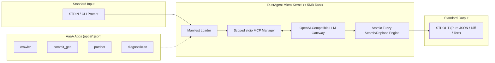

# DustAgent

> **The smallest agent runtime that actually works.**

[](LICENSE)
[](https://www.rust-lang.org)

---

## ⚠️ Wait — Don't use `dust` directly.

**Let an agent do it.**

Seriously. The whole point of DustAgent is that _you_ don't interact with it.
Agents call agents. Pipelines call agents. CI calls agents. You don't.

```bash
# ❌ Wrong mental model: you, typing, waiting, reading
dust run crawler "https://news.ycombinator.com"

# ✅ Right mental model: an orchestrator agent invoking a scoped subagent
dust run researcher "summarize trending Rust crates" \
  | dust run patcher -f README.md "update the Ecosystem section"
```

If you're tempted to stare at the output and manually do something with it —
**you're still in the loop**. Build an agent that does that next step instead.

---

## What is DustAgent?

DustAgent is an **Agent-as-an-Application (AaaA)** runtime. It turns a 10-line JSON manifest into a fully functional, single-purpose AI agent that reads from `STDIN`, thinks, and writes to `STDOUT`. No conversation. No confirmation prompts. No runtime bloat.

The core is a ~300-line Rust micro-kernel. It handles LLM streaming, scoped stdio MCP tool management, and atomic fuzzy search/replace patching. Everything else lives in declarative `apps/*.json` manifests — one file per agent, swappable at runtime without recompilation.

The key insight: an LLM doesn't need a framework. It needs a sharp prompt, exactly the right tools (and _nothing else_), and a reliable patch engine. That's it.

---

## Quickstart

### Prerequisites

```bash
git clone https://github.com/choratools/dustagent.git
cd dustagent
cargo install --path .

export OPENAI_API_KEY="sk-..."          # or any OpenAI-compatible endpoint
# export OPENAI_BASE_URL="http://localhost:30000/v1"  # for local vLLM/SGLang
```

### 1. Create an agent (let AI design it)

```bash
dust new crawler "Extract structured data from URLs as JSON"
```

This scaffolds `apps/crawler.json` — a complete agent manifest. The scaffold agent writes the system prompt, selects appropriate MCP tools, and sets the output schema. You don't write any code.

### 2. Run it

```bash
dust run crawler "https://news.ycombinator.com"
```

Output is pure JSON on `STDOUT`. Exit code `0` on success. Nothing else.

### 3. Chain agents

```bash
# Feed a list of URLs through crawler, then summarize each result
cat urls.txt | dust run crawler | dust run summarizer

# Generate a commit message straight from staged diff
git diff --cached | dust run commit_gen

# Pipe compiler errors into an auto-patcher
cargo check 2>&1 | dust run diagnostician | dust patch -f src/lib.rs "fix reported error"
```

Agents are Unix filters. Compose them with `|`, `xargs`, `while read`, or any shell primitive.

---

## Built-in Tools (always available)

Every agent gets these five native Rust tools at zero cost — no subprocess, no MCP server spawn:

| Tool | Signature | Description |
| :--- | :--- | :--- |
| `dustagent__sleep` | `(ms: u64)` | Async non-blocking delay up to 300s |
| `dustagent__timestamp` | `(format?: "unix_ms"\|"iso8601"\|"both")` | Current UTC time |
| `dustagent__uuid` | `()` | Random UUID v4 |
| `dustagent__env_get` | `(name: string)` | Read an environment variable |
| `dustagent__hash` | `(input: string)` | SHA-256 hex digest |

External MCP servers (`mcp-server-fetch`, `mcp-server-postgres`, Playwright, etc.) are declared per-app in the manifest and launched on-demand as stdio subprocesses.

---

## Architecture



**Key property: MCP scope isolation.** When `dust run crawler` executes, only the `fetch` MCP server exists in the model's context. The filesystem tool, the git tool, the database tool — they don't appear. The model cannot hallucinate calls to tools that aren't there. Side effects are architecturally impossible, not just discouraged.

---

## App Manifest Schema

Every agent is a single JSON file in `apps/`:

```json
{
  "$schema": "dustagent/app-v1",
  "name": "crawler",
  "description": "Extract structured data from a URL as clean JSON",
  "default_model": "gpt-4o-mini",
  "system_prompt": "You are a headless web extractor. Fetch the given URL and output clean JSON only. No conversational text. No markdown fences. Pure JSON.",
  "mcp_servers": {
    "fetch": {
      "command": "uvx",
      "args": ["mcp-server-fetch"]
    }
  },
  "output_format": "raw_json"
}
```

| Field | Type | Required | Description |
| :--- | :--- | :---: | :--- |
| `$schema` | `string` | ✓ | Always `"dustagent/app-v1"` |
| `name` | `string` | ✓ | App identifier (used in `dust run <name>`) |
| `description` | `string` | ✓ | One-line human description (also used by scaffold agent) |
| `system_prompt` | `string` | ✓ | The agent's full operating instructions |
| `default_model` | `string` | — | LLM model override (defaults to env `DUST_MODEL`) |
| `mcp_servers` | `object` | — | Map of MCP server name → `{command, args, env?}` |
| `output_format` | `string` | — | `"text"` (default) \| `"raw_json"` \| `"diff"` |

No code. No compilation. Drop the file, run the agent.

---

## Philosophy: Agent as an Application

**AaaA** is the operating principle behind DustAgent. Four rules:

1. **Single Responsibility** — one agent does one thing. `crawler` crawls. `patcher` patches. They don't do each other's job.

2. **Zero Interaction** — no `[y/N]` prompts, no "Here's what I'll do" preambles. The agent receives input, executes, and exits. It is invoked by automation, not by humans waiting at a terminal.

3. **Scoped MCP** — each app declares exactly the tools it needs. Nothing more enters the model's context window. Tool call accuracy approaches 100% because there are no wrong choices to make.

4. **Unix Pipeline** — agents are filters. `STDIN → agent → STDOUT`. Chain them with `|`. Orchestrate them with shell scripts. Use `jq`, `xargs`, `tee` between them. No special orchestration framework required.

The result: agents composable like `curl`, `grep`, and `sed` — but with LLM reasoning embedded.

---

## Contributing

```bash
cargo fmt --check
cargo clippy --all-targets -- -D warnings
cargo test
```

See [CONTRIBUTING.md](CONTRIBUTING.md) for architecture guidelines and PR conventions.

---

## License

Dual-licensed under [MIT](LICENSE-MIT) or [Apache 2.0](LICENSE-APACHE), at your option.
