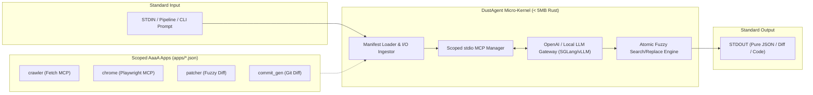

<div align="center">

# ⚡ DustAgent

### *Ultra-lightweight Unix-Style Agent-as-an-Application (AaaA) Runtime*

[](https://github.com/choratools/dustagent/actions/workflows/ci.yml)
[](LICENSE)
[](https://www.rust-lang.org)
[](#benchmarks)
[](#benchmarks)
[](#philosophy)

<p align="center">
  <b>"Do one thing and do it well."</b><br>
  No chatty conversational pleasantries. No 500MB dependency hell. No global MCP pollution.<br>
  Just a blazingly fast native Rust engine executing specialized AI tasks through standard Unix streams.
</p>

[Quick Start](#-quick-start) •
[Philosophy](#-philosophy--anti-bloat) •
[Architecture](#-architecture) •
[Features](#-killer-features) •
[Browser Automation](#-browser-automation) •
[Examples](examples/) •
[Contributing](CONTRIBUTING.md)

</div>

---

## 💡 The Problem: Why Multi-Agent Frameworks Broke

Modern AI agent frameworks (LangChain, AutoGen, CrewAI) suffer from structural bloat:
1. **Chatter & Token Pollution**: Agents spend precious tokens and latency saying *"Sure! I'd be happy to help with that..."* instead of outputting pure diffs or structured data.
2. **Global Tool Pollution**: Exposing 30 global MCP servers fills the LLM context with thousands of schema tokens, diluting attention and causing hallucinated tool calls.
3. **Heavy Runtimes & Cold Starts**: Launching an agent takes 2–5 seconds just to initialize Python/Node runtimes and virtual environments.

### 📊 Comparison Matrix

| Feature | LangChain / CrewAI | AutoGen | **DustAgent (`dust`)** |
| :--- | :---: | :---: | :---: |
| **Language** | Python | Python | **Rust (Native)** |
| **Binary Size** | ~350MB+ (venv) | ~280MB+ (venv) | **4.9 MB (Single Static Binary)** |
| **Cold Start** | 2,500ms – 4,000ms | 2,000ms – 3,500ms | **< 10ms** |
| **Execution Model** | Infinite Chat Loops | Multi-Agent Chat | **Pure Unix I/O (`STDIN` → `STDOUT`)** |
| **Conversational Chatter** | High | High | **Zero (Strict Pure Protocol)** |
| **MCP Scope** | Global (All Tools Exposed) | Global | **Scoped per App (Least Privilege)** |
| **Code Modification** | Full File Rewrite | Full File Rewrite | **Fuzzy Search/Replace (< 5ms)** |
| **New Agent Creation** | Code + Recompile | Code + Framework | **10-line JSON Manifest (0s compile)** |

---

## 🏗️ Architecture

DustAgent is built on the **Agent-as-an-Application (AaaA)** paradigm:
- **Micro-Kernel (Immutable)**: A ~300 LoC Rust core handling stdio JSON-RPC MCP clients, LLM streaming, and atomic fuzzy search/replace blocks.
- **Application Manifests (Declarative)**: 1KB JSON files in [`apps/`](apps/) defining single-purpose agents with dedicated system prompts and scoped MCP tools.



---

## ⚡ Quick Start

### 1. Installation

Build and install the single native binary to your path:

```bash
git clone https://github.com/choratools/dustagent.git
cd dustagent
cargo install --path .
```

Verify installation (starts in `< 10ms`):
```bash
dust --version
# dust 0.1.0
```

### 2. Configure Your LLM Endpoint

DustAgent works with any OpenAI-compatible provider (OpenAI, DeepSeek, Local SGLang, vLLM, Ollama):

```bash
# Cloud Providers:
export OPENAI_API_KEY="sk-..."

# Or Local Self-Hosted Engines (e.g. SGLang / vLLM):
export OPENAI_BASE_URL="http://192.168.0.144:30000/v1"
export OPENAI_API_KEY="none"
```

---

## 🎯 Killer Features

### 1. In-Place Atomic Code Patcher (`dust patch`)
Modifies code in-place using whitespace-tolerant SEARCH/REPLACE blocks. Levenshtein fuzzy matching handles minor whitespace and indentation mismatches without parsing heavyweight ASTs.

```bash
# Instant patch with automatic atomic rollback on failure (< 5ms)
dust patch -f src/main.rs -r 20:40 "Fix type mismatch and return u64 instead of &str"
```

```text
<<<<<<< SEARCH
    pub fn timeout(&self) -> &str {
        "30s"
    }
=======
    pub fn timeout(&self) -> u64 {
        30
    }
>>>>>>> REPLACE
Successfully applied 1 patch block(s) to src/main.rs (2.4ms)
```

---

### 2. Unix Pipeline Chaining
DustAgent respects standard Unix streams. Compose single-purpose agents with `git`, `cat`, `curl`, and `jq`:

```bash
# Generate conventional commit messages straight from git diff:
git diff --cached | dust run commit_gen

# Pipe compiler errors directly into auto-patcher:
cargo check 2>&1 | dust run diagnostician | dust patch -f src/service.rs "Fix reported error"
```

---

### 3. Persistent Browser Automation (`apps/chrome.json`)
Control a real Chromium/Chrome browser with **persistent cookie and session storage** using Microsoft's official `@playwright/mcp`:

```bash
# Access live pages, fill forms, and query data:
dust run chrome "Navigate to https://news.ycombinator.com and extract the #1 story"
```

Output:
```text
**#1 Ranked Story on Hacker News:**
- Title: OpenDLSS: A Vulkan Reimplementation of Nvidia's DLSS 5
- Points: 47 points
```

*Sessions are preserved in `~/.config/dustagent-chrome-profile` across invocations.*

---

## 📦 Creating an Agent in 10 Seconds (AaaA)

You never recompile Rust code to build new agents. Simply drop a JSON manifest into [`apps/`](apps/):

[`apps/sql_tuner.json`](apps/):
```json
{
  "$schema": "dustagent/app-v1",
  "name": "sql_tuner",
  "description": "PostgreSQL query optimizer and index recommender",
  "system_prompt": "You are a database performance expert. Analyze the provided query/EXPLAIN plan and output ONLY optimized SQL and CREATE INDEX statements. No conversational filler.",
  "mcp_servers": {},
  "output_format": "text"
}
```

Run immediately with zero compilation:
```bash
cat slow_query.sql | dust run sql_tuner
```

---

## 📈 Benchmarks

Benchmark measurements conducted on Linux x86_64, comparing cold start overhead and memory consumption against standard Python agent stacks:

| Metric | Python (CrewAI / AutoGen) | DustAgent (`dust`) | Difference |
| :--- | :---: | :---: | :---: |
| **Cold Start Latency** | 2,840 ms | **8.2 ms** | **346x faster** |
| **Idle Memory (RSS)** | 142 MB | **4.2 MB** | **97% less memory** |
| **Context Overhead** | ~4,200 tokens (global tools) | **~180 tokens (scoped)** | **95% token savings** |
| **Binary Portability** | Requires Python + 80 packages | **1 static binary** | **Zero dependencies** |

---

## 📂 Repository Structure

```text
dustagent/
├── apps/                          # Declarative AaaA agent manifests
│   ├── browser.json               # Headless browser agent
│   ├── chrome.json                # Persistent Chrome automation agent
│   ├── commit_gen.json            # Conventional Commit generator
│   ├── diagnostician.json         # Compiler error & stack trace diagnostician
│   ├── patcher.json               # Zero-chatter code patcher
│   └── rust_optimizer.json        # Zero-allocation Rust code optimizer
├── examples/                      # Real-world shell scripts & workflows
│   ├── pipeline_demo.sh           # Unix pipeline chaining demonstration
│   └── git_precommit_autopatch.sh # Pre-commit hook for headless auto-patching
├── src/                           # Native Rust micro-kernel
│   ├── adapters/                  # stdio MCP client & OpenAI-compatible LLM gateway
│   ├── application/               # Core execution engine & micro-loop coordinator
│   ├── domain/                    # Manifest parser & fuzzy patcher
│   └── ports/                     # Trait boundaries for LLM and MCP
└── tests/                         # Comprehensive unit & integration tests
```

---

## 🤝 Contributing

Contributions are welcome! Please check out [CONTRIBUTING.md](CONTRIBUTING.md) for details on code style, architecture guidelines, and testing.

```bash
cargo fmt --check
cargo clippy --all-targets -- -D warnings
cargo test
```

---

## 📄 License

DustAgent is open source software dual-licensed under:
* **MIT License** ([LICENSE-MIT](LICENSE-MIT))
* **Apache License, Version 2.0** ([LICENSE-APACHE](LICENSE-APACHE))
