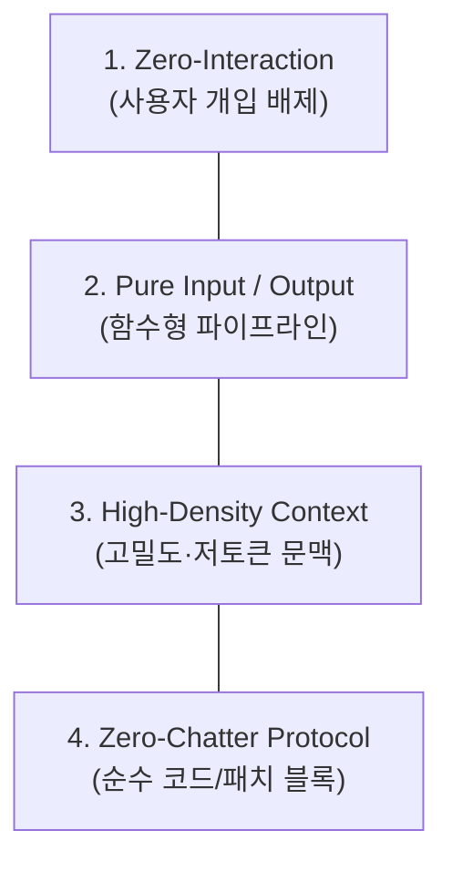

# 🎯 01. 개념 및 설계 철학

> "완벽함이란 더 이상 더할 것이 없을 때가 아니라, 더 이상 뺄 것이 없을 때 완성된다."  
> — 앙투안 드 생텍쥐페리

DustAgent(먼지 에이전트)는 **"가장 작고, 잡음이 없으며, 빠르고 정확한 인라인 코딩 에이전트"**를 목표로 합니다.

관련 문서: [[02_시스템_아키텍처]], [[03_초경량_MCP_엔진]], [[04_인라인_패치_및_수정_엔진]]

---

## 1. 기존 에이전트 프레임워크의 문제의식 (Anti-Bloat)

현재 AI 에이전트 생태계(LangChain, CrewAI, AutoGen 등)는 거대한 추상화 계층으로 인해 심각하게 비대해졌습니다:

1. **무거운 의존성과 지연 시간 (Latency Bloat)**
   - 수십~수백 개의 Python 패키지 의존성.
   - CLI 실행 한 번에 수 초씩 걸리는 콜드 스타트(Cold Start).
2. **과도한 잡담과 상호작용 (Chatter & Prompt Pollution)**
   - "네, 작성해 드리겠습니다!", "이 파일의 변경 사항은 다음과 같습니다..." 등의 불필요한 서술형 텍스트 생성.
   - 이는 토큰 낭비, 응답 지연(Time-to-First-Token 및 Generation Latency), 파싱 실패의 주원인이 됨.
3. **불필요한 인터랙션 루프 (Interactive Overhead)**
   - "이 변경을 적용할까요? [y/N]", "다음 단계로 넘어갈까요?" 같은 상호작용은 자동화 파이프라인(IDE 단축키, Git pre-commit 훅, CI 스크립트)과 어울리지 않음.

> [!IMPORTANT]
> **핵심 통찰 (Core Insight)**  
> LLM이 코드를 잘 짜는 것은 거대한 에이전트 프레임워크 때문이 아닙니다. **최신 프론티어 모델(Claude 3.5 Sonnet, GPT-4o 등)의 순수 추론 능력 + 정교한 컨텍스트 주입 + 무결점 Patch 엔진**이 성능의 99%를 결정합니다. 프레임워크의 껍데기를 모두 걷어내도 성능은 100% 유지되거나 오히려 향상됩니다.

---

## 2. DustAgent 4대 설계 철학

### ① Zero-Interaction (인터랙션 전면 배제)
* 에이전트는 사용자와 대화하지 않습니다.
* `명령 인입` -> `자율 실행 및 패치` -> `결과 산출 및 종료`의 단일 생명주기를 가집니다.
* 에디터의 인라인 단축키(Cmd+K), 셸 명령어 체이닝(`| dustagent`), 배치 작업에 완벽하게 부합합니다.

### ② Pure Input / Pure Output (함수형 파이프)
* 수학적 함수처럼 동작합니다: $f(Context, Instruction, Tools) \rightarrow Patch$
* **Input**: 
  - 타깃 파일 경로 또는 STDIN 스트림
  - 변경할 라인 범위 또는 선택 영역(Selection)
  - 지시어 (Prompt)
  - (선택) MCP를 통해 연결된 도구 및 리소스
* **Output**:
  - 파일 인플레이스(In-place) 패치 적용 또는 STDOUT 스트림

### ③ High-Density Context (고밀도 문맥 조립)
* 파일 전체를 무식하게 모델에 던지는 것은 토큰 낭비이자 환각(Hallucination)의 지름길입니다.
* 대상 코드 블록 앞뒤 $N$라인의 로컬 컨텍스트(Surrounding context)와 필요한 최소한의 심볼 정의(MCP/ctags 기반)만 압축하여 주입합니다.

### ④ Zero-Chatter Protocol (잡음 제로)
* 모델에게 시스템 레벨에서 인사말, 마크다운 주석, 안내문 생성을 엄격히 금지합니다.
* 오직 정형화된 **Search/Replace Block** 또는 **Raw Code**만 산출하게 하여 파싱 성공률을 100%로 수렴시킵니다.

---

## 3. 타사 인라인 모드와의 철학적 차별점

| 비교 항목 | Cursor (Cmd+K) | OpenCode / Claude Code | **DustAgent** |
| :--- | :--- | :--- | :--- |
| **환경 종속성** | 전용 IDE 필수 | Node/Python 거대 패키지 | **어디서나 동작하는 극초경량 CLI** |
| **실행 모드** | 인터랙티브 인라인 diff UI | 대화형 터미널 REPL | **완전 헤드리스(Headless) 인입/산출** |
| **도구 확장성** | 내부 폐쇄형 | 독자 도구 또는 무거운 MCP | **초경량 표준 MCP (stdio JSON-RPC)** |
| **구조 복잡도** | 비공개 C++/Electron 앱 | 수만 줄 TypeScript | **단일 목적 핵심 엔진 (< 1,000 LoC)** |

---
다음 단계: [[02_시스템_아키텍처]]에서 DustAgent의 내부 3단계 데이터 파이프라인을 확인하십시오.
