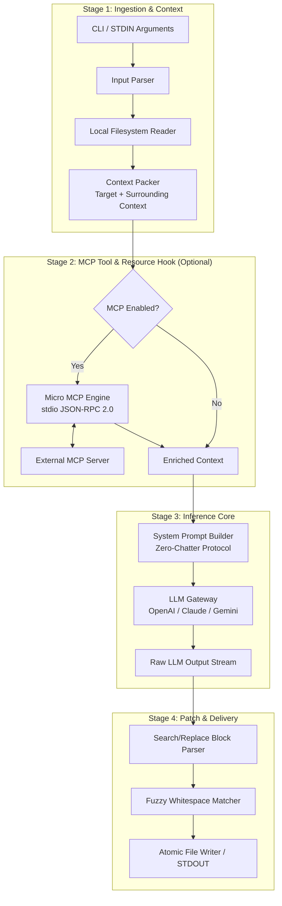
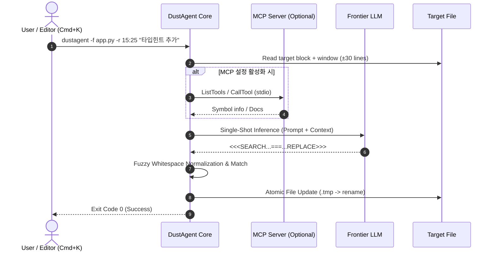

# 🏗️ 02. 시스템 아키텍처

> 관련 문서: [[01_개념_및_설계철학]], [[03_초경량_MCP_엔진]], [[04_인라인_패치_및_수정_엔진]], [[05_인터페이스_및_CLI_스펙]]

DustAgent는 거대한 상태 머신이나 비동기 이벤트 루프 대신, 단방향으로 흐르는 **함수형 4단계 파이프라인(4-Stage Pipeline)** 구조를 채택합니다.

---

## 1. 전체 아키텍처 다이어그램

---

## 2. 4대 핵심 모듈 명세

### 1) Context Ingestor (문맥 수집기)
* **역할**: 입력으로 들어온 타깃 파일, 라인 번호 범위(`--range 25:40`), 프롬프트 지시어를 분석합니다.
* **로컬 윈도우 추출 (Surrounding Context Window)**:
  - 타깃 블록의 전후 30~50라인을 자동으로 함께 읽어 들여 들여쓰기 수준, 스코프(함수/클래스 정의), 임포트 문을 파악합니다.
  - 파일 전체를 읽을 필요가 없으므로 파일이 10,000줄이어도 수 밀리초 내에 파싱을 완료합니다.

### 2) Micro MCP Engine (초경량 MCP 브리지)
* **역할**: Model Context Protocol을 통해 외부 컨텍스트(DB 스키마, LSP 정의, Git 로그 등)가 필요할 때 표준 stdio 기반으로 도구를 쿼리합니다.
* **특징**: 무거운 외부 라이브러리 없이 순수 `JSON-RPC 2.0` over `stdio`로 작동하여 0ms에 가까운 속도로 외부 도구를 호출합니다. (자세한 스펙은 [[03_초경량_MCP_엔진]] 참조)

### 3) Inference Gateway (추론 게이트웨이)
* **역할**: 프론티어 LLM과 통신합니다.
* **단발 추론 (Single-Shot In-Out)**:
  - 다중 턴 대화 히스토리를 축적하지 않음.
  - 엄격한 시스템 프롬프트(Zero-Chatter)로 오직 변경 블록만 스트리밍 생성 유도.
  - 스트리밍 파싱(Streaming Parsing)을 통해 첫 번째 바이트가 들어오는 즉시 패치 준비.

### 4) Patch & Delivery Engine (무결점 패치 엔진)
* **역할**: 모델이 반환한 `SEARCH / REPLACE` 블록을 실제 파일에 원자적(Atomic)으로 적용합니다.
* **Fuzzy Normalization**: 공백 오차, 개행 오차(`\r\n` vs `\n`), 미세한 들여쓰기 불일치를 자동 보정하여 패치 실패율을 0%에 수렴시킵니다. (자세한 알고리즘은 [[04_인라인_패치_및_수정_엔진]] 참조)

---

## 3. 실행 라이프사이클 (Execution Sequence)

---

## 4. 자가 교정 (Self-Correction) 메커니즘 (선택적)

경우에 따라 LLM의 수정 결과에 문법 에러(Syntax Error)가 발생할 수 있습니다. DustAgent는 사용자 인터랙션 없이 **최대 1회 자가 교정(1-Shot Self-Correction)**을 수행할 수 있는 옵션(`--auto-repair`)을 제공합니다:

1. 패치 임시 적용 후 언어별 빠른 문법 검사기 실행 (예: Python `ast.parse()`, JS/TS `oxc` or `esbuild`).
2. 에러 발생 시, 에러 메시지와 함께 직전 출력 블록을 단 1회 재질의.
3. 통과 시 즉시 파일 저장 후 종료.

---
다음 단계: [[03_초경량_MCP_엔진]]에서 Zero-Dependency MCP 클라이언트의 구체적 통신 구조를 확인하십시오.
