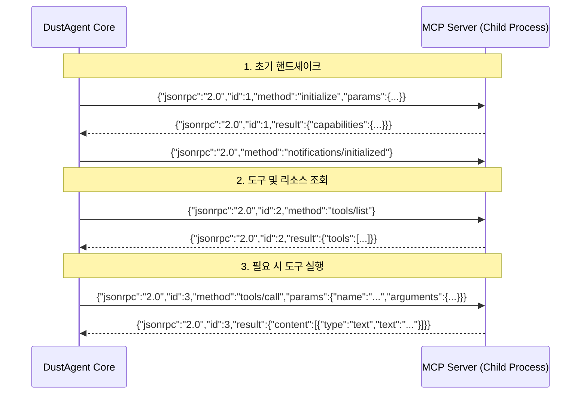
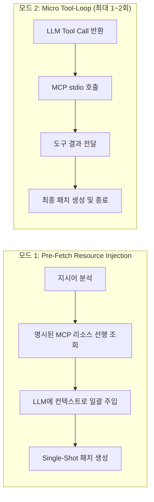

# 🔌 03. 초경량 MCP 엔진 설계 (Model Context Protocol)

> 관련 문서: [[01_개념_및_설계철학]], [[02_시스템_아키텍처]], [[경쟁사분석/03_Anthropic_Claude_Code_분석]]

DustAgent는 Anthropic 주도의 오픈 표준인 **Model Context Protocol (MCP)**을 완벽히 지원합니다. 단, 비대한 공식 SDK를 통째로 가져오지 않고, **순수 JSON-RPC 2.0 over stdio** 방식을 100줄 이내의 초경량 클라이언트로 직접 내장합니다.

---

## 1. 왜 "초경량(Zero-Dependency)" MCP인가?

공식 MCP SDK(Python `mcp`, Node `@modelcontextprotocol/sdk`)는 Pydantic, AnyIO, Starlette 등 수많은 부가 패키지를 동반하여 콜드 스타트를 수백 밀리초 이상 지연시킵니다.

그러나 MCP 표준의 본질은 놀라울 정도로 단순합니다:
* 프로세스 간 통신: 자식 프로세스(Subprocess)의 **`stdin` / `stdout`**
* 메시지 프로토콜: **`JSON-RPC 2.0` (줄 단위 개행 구분 `\n`)**

DustAgent는 언어 기본 라이브러리(`subprocess` + `json`)만으로 동작하는 초경량 MCP 드라이버를 구현합니다.



---

## 2. MCP 설정 호환 규격 (`.mcp.json`)

Claude Code 및 Cursor, VS Code와 완벽히 호환되도록 프로젝트 루트의 `.mcp.json` 또는 글로벌 `~/.config/dustagent/mcp.json`을 읽습니다.

```json
{
  "mcpServers": {
    "git": {
      "command": "mcp-server-git",
      "args": ["--repository", "."]
    },
    "postgres": {
      "command": "npx",
      "args": ["-y", "@modelcontextprotocol/server-postgres", "postgresql://localhost/mydb"]
    },
    "custom-tools": {
      "command": "python",
      "args": ["tools/my_mcp_server.py"]
    }
  }
}
```

---

## 3. 핵심 JSON-RPC 통신 규격 (최소 구현체)

DustAgent가 내부적으로 처리하는 JSON-RPC 패킷의 최소 형태입니다:

### 1) Initialize Handshake
```json
// Client -> Server
{
  "jsonrpc": "2.0",
  "id": 1,
  "method": "initialize",
  "params": {
    "protocolVersion": "2024-11-05",
    "capabilities": {},
    "clientInfo": { "name": "dustagent", "version": "0.1.0" }
  }
}
```

### 2) Tools List
```json
// Client -> Server
{
  "jsonrpc": "2.0",
  "id": 2,
  "method": "tools/list"
}

// Server -> Client
{
  "jsonrpc": "2.0",
  "id": 2,
  "result": {
    "tools": [
      {
        "name": "get_table_schema",
        "description": "Returns PostgreSQL table schema",
        "inputSchema": {
          "type": "object",
          "properties": {
            "table_name": { "type": "string" }
          },
          "required": ["table_name"]
        }
      }
    ]
  }
}
```

### 3) Tools Call
```json
// Client -> Server
{
  "jsonrpc": "2.0",
  "id": 3,
  "method": "tools/call",
  "params": {
    "name": "get_table_schema",
    "arguments": { "table_name": "users" }
  }
}
```

---

## 4. 인라인 모드에서 MCP의 운용 전략

일반 에이전트는 사용자와 대화하며 도구를 호출하지만, DustAgent는 **Zero-Interaction 인라인 모드**입니다. 따라서 MCP를 다음 2가지 모드로 운용합니다:



1. **Pre-Fetch 모드 (기본 권장, 극초고속)**:
   - 사용자가 CLI 옵션으로 지정한 MCP 리소스(`--mcp-resource git://diff` 또는 `postgres://schema`)를 실행 즉시 긁어와 컨텍스트로 LLM에 던집니다.
   - LLM 왕복(Round-trip) 1회만으로 완결.
2. **Micro Tool-Loop 모드**:
   - 지시어 처리에 외부 정보가 반드시 필요한 경우(예: DB 마이그레이션 코드 생성), LLM에게 MCP 도구 스키마를 전달하고 `tool_calls`를 허용합니다.
   - 사용자 확인 없이 즉시 MCP 도구를 실행하고 결과를 피드백하여 최종 코드를 산출합니다. (루프 상한: 최대 2회로 엄격 제한하여 무한 루프 방지)

---
다음 단계: [[04_인라인_패치_및_수정_엔진]]에서 LLM의 결과를 원본 파일에 98% 이상의 성공률로 적용하는 핵심 패치 알고리즘을 확인하십시오.
