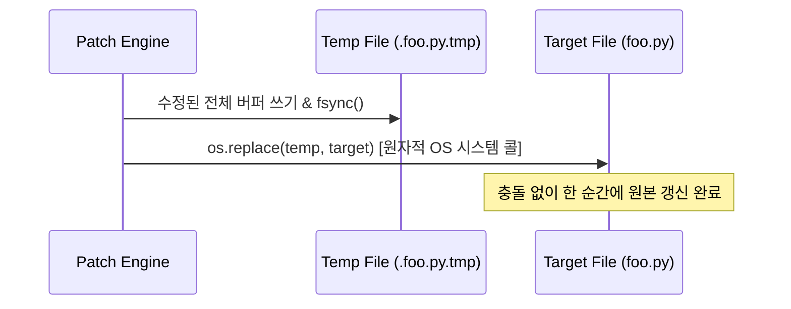

# 🩹 04. 인라인 패치 및 수정 엔진 (Inline Patch Engine)

> 관련 문서: [[01_개념_및_설계철학]], [[02_시스템_아키텍처]], [[경쟁사분석/04_Aider_분석]]

인라인 코딩 에이전트의 체감 성능과 신뢰성을 결정하는 가장 중요한 요소는 **"LLM이 생성한 수정안이 원본 파일에 100% 무결점으로 적용되는가"**입니다.

---

## 1. 코드 수정 포맷 비교 (왜 Search/Replace 인가?)

| 포맷 방식 | 장점 | 단점 | DustAgent 채택 여부 |
| :--- | :--- | :--- | :--- |
| **전체 파일 재작성 (Whole File)** | 적용 로직 단순 | 파일이 클수록 토큰 폭증, 응답 지연, 중간 코드 생략(`// rest of code`) 환각 | ❌ (인라인 부적합) |
| **Unified Diff (`--- / +++`)** | 표준적인 포맷 | LLM이 라인 수(`@@ -12,5 +12,7 @@`) 계산에 취약하여 패치 실패율 > 40% | ❌ (폐기) |
| **Search/Replace Block** | 토큰 절약, 직관적, 라인 계산 불필요 | 원본 코드의 공백/들여쓰기 불일치 시 매칭 실패 가능 | **✅ 기본 채택 (Fuzzy 알고리즘으로 보완)** |

---

## 2. Search / Replace 블록 프로토콜

DustAgent가 LLM에게 요구하는 엄격한 출력 블록 규격입니다:

```text
<<<<<<< SEARCH
def calculate_tax(amount: float) -> float:
    return amount * 0.1
=======
def calculate_tax(amount: float, rate: float = 0.1) -> float:
    """Calculates tax with customizable rate."""
    return amount * rate
>>>>>>> REPLACE
```

* `<<<<<<< SEARCH`: 수정 대상이 되는 기존 원본 코드의 고유한 조각 (1줄 이상).
* `=======`: 구분자.
* `>>>>>>> REPLACE`: 새로 대체될 수정 코드.

---

## 3. 4단계 단계별 Fuzzy Matcher 알고리즘

LLM은 종종 원본의 들여쓰기 탭/스페이스 개수를 미세하게 틀리거나, trailing whitespace를 누락합니다. DustAgent는 이를 구제하기 위해 4단계 순차 매칭 파이프라인을 가동합니다.

```mermaid
flowchart TD
    IN[Search Block 수신] --> STAGE1{Stage 1:<br/>Exact String Match?}
    STAGE1 -- 일치 --> APPLY[즉시 치환]
    STAGE1 -- 불일치 --> STAGE2{Stage 2:<br/>Whitespace-Stripped Match?}
    STAGE2 -- 일치 --> APPLY
    STAGE2 -- 불일치 --> STAGE3{Stage 3:<br/>Indentation Relative Match?}
    STAGE3 -- 일치 --> APPLY
    STAGE3 -- 불일치 --> STAGE4{Stage 4:<br/>Levenshtein Window Match (>90%)}
    STAGE4 -- 일치 --> APPLY
    STAGE4 -- 실패 --> ERR[Patch Error 발생<br/>(원본 보존)]
```

### 단계 1: 완전 일치 (Exact String Match)
* 원본 텍스트에 `search_text`가 정확히 1회 존재하는지 검사합니다.
* 일치 시 $O(N)$ 속도로 즉각 치환합니다.

### 단계 2: 공백 제거 라인 단위 매칭 (Whitespace-Stripped Match)
* 각 라인의 앞뒤 공백(`line.strip()`)을 제거한 후 줄 단위로 비교합니다.
* 개행 문자 차이(`\r\n` vs `\n`) 및 행 끝 불필요한 공백을 무시합니다.

### 단계 3: 상대 들여쓰기 보존 매칭 (Indentation Relative Match)
* 검색 블록 첫 줄의 들여쓰기 깊이를 기준으로 원본 위치를 탐색한 후, 교체 블록의 들여쓰기를 원본 컨텍스트의 들여쓰기 깊이에 맞춰 동적으로 재조정(Re-indent)합니다.

### 단계 4: Levenshtein 퍼지 윈도우 매칭 (Fuzzy Fallback)
* 1~3단계가 모두 실패했을 때, 원본 파일의 슬라이딩 윈도우와 검색 블록 간의 유사도(Similarity Ratio)를 계산합니다.
* 유사도가 90% 이상인 유일한 구간이 발견되면 안전하게 해당 구간을 교체합니다.

---

## 4. 원자적 파일 쓰기 (Atomic Write)

패치 적용 도중 전원 차단, 강제 종료, 디스크 쓰기 오류가 발생해도 원본 코드가 절대 유실되지 않도록 **원자적 파일 교체(Atomic Rename)**를 보장합니다.



---
다음 단계: [[05_인터페이스_및_CLI_스펙]]에서 DustAgent를 호출하고 에디터에 연동하는 CLI 및 I/O 규격을 확인하십시오.
