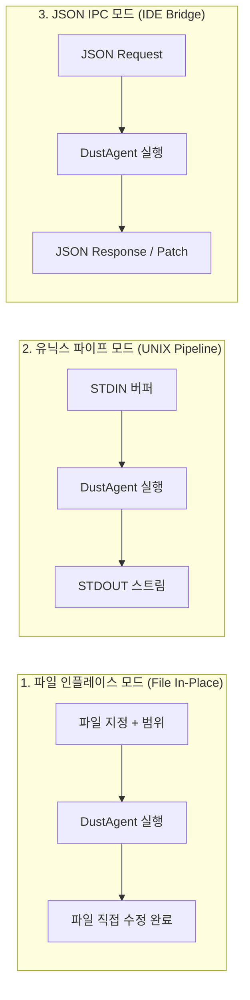

# 💻 05. 인터페이스 및 CLI 스펙

> 관련 문서: [[01_개념_및_설계철학]], [[02_시스템_아키텍처]], [[04_인라인_패치_및_수정_엔진]]

DustAgent는 사용자와 대화하는 인터랙티브 프롬프트를 일절 배제하고, **순수 CLI 인자 및 UNIX 표준 스트림(STDIN/STDOUT)**으로만 통신합니다.

---

## 1. 실행 모드 (Operating Modes)



---

## 2. CLI 명령어 및 플래그 명세

```bash
dustagent [OPTIONS] "<INSTRUCTION>"
```

### 주요 옵션 표

| 플래그 | 단축형 | 기본값 | 설명 |
| :--- | :--- | :--- | :--- |
| `--file` | `-f` | None | 수정할 대상 파일 경로 |
| `--range` | `-r` | None | 수정 대상 라인 범위 (예: `15:30` 또는 `15`부터 단일 행) |
| `--mcp` | `-m` | auto | 활성화할 MCP 서버 이름 (지정 안 할 시 `.mcp.json` 자동 로드) |
| `--model` | `-M` | `claude-3-5-sonnet` | 추론에 사용할 백엔드 모델 |
| `--pipe` | `-p` | false | STDIN 입력을 받아 STDOUT으로만 결과를 출력하는 필터 모드 |
| `--diff` | `-d` | false | 파일을 직접 수정하지 않고 Unified Diff 형식으로 STDOUT 출력 |
| `--dry-run`| | false | 실제 파일에 쓰지 않고 적용될 Search/Replace 블록만 검증 |
| `--quiet` | `-q` | false | 모든 로깅 침묵 (에러 발생 시에만 exit code != 0 반환) |

---

## 3. 대표 사용 시나리오

### 1) 특정 파일의 특정 함수 인라인 수정
```bash
# app.py 40번째부터 60번째 라인을 비동기(async)로 변경
dustagent -f src/app.py -r 40:60 "이 핸들러를 asyncio 기반으로 리팩터링해줘"
```

### 2) 파이프라인 필터 (Vim/Neovim visual selection 연동)
```bash
# 선택 영역을 stdin으로 밀어넣고 stdout으로 교체
cat snippet.py | dustagent -p "이 함수에 타입 힌트와 Google 스타일 docstring 추가" > snippet_new.py
```

### 3) MCP 리소스를 결합한 인라인 패치
```bash
# git staged 변경점이나 DB 스키마를 참고하여 코드 수정
dustagent -f models/user.py "users 테이블의 최근 마이그레이션 변경사항 반영"
```

---

## 4. IDE 에디터 플러그인 연동 규격 (JSON-IPC)

VS Code, Cursor, Neovim, JetBrains 플러그인이 DustAgent를 서브프로세스로 구동할 때 사용하는 경량 JSON 규격입니다.

### Request (to STDIN)
```json
{
  "instruction": "Convert callback to async/await",
  "filePath": "src/service.ts",
  "selection": {
    "startLine": 12,
    "endLine": 28,
    "content": "function fetchUser(id, cb) { ... }"
  }
}
```

### Response (from STDOUT)
```json
{
  "status": "success",
  "patches": [
    {
      "startLine": 12,
      "endLine": 28,
      "original": "function fetchUser(id, cb) { ... }",
      "modified": "async function fetchUser(id: string): Promise<User> { ... }"
    }
  ],
  "tokensUsed": 342,
  "elapsedMs": 850
}
```

---

## 5. 종료 코드 (Exit Codes)

| 코드 | 상태 | 의미 |
| :---: | :--- | :--- |
| `0` | `SUCCESS` | 패치 정상 적용 완료 |
| `1` | `INVALID_ARGS` | 잘못된 CLI 인자 또는 존재하지 않는 파일 |
| `2` | `LLM_API_ERROR` | LLM API 인증 실패, 쿼터 초과, 네트워크 단절 |
| `3` | `PATCH_FAILED` | Search 블록 매칭 실패 (Fuzzy fallback까지 전부 불일치) |
| `4` | `MCP_ERROR` | 필수 지정된 MCP 서버 구동 또는 응답 실패 |

---
다음 단계: [[06_구현_로드맵_및_기술스택]]에서 기술 스택 선택과 단계별 마일스톤을 확인하십시오.
