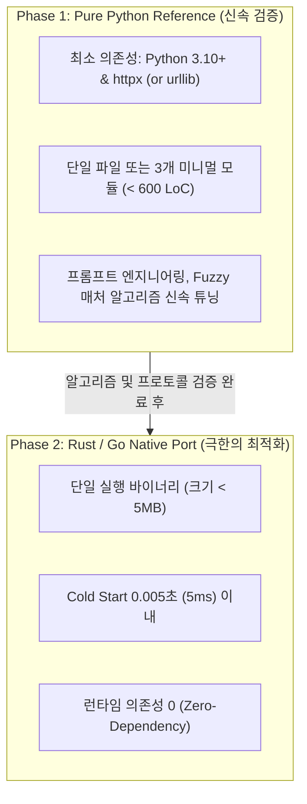

# 🚀 06. 구현 로드맵 및 기술 스택

> 관련 문서: [[01_개념_및_설계철학]], [[02_시스템_아키텍처]], [[03_초경량_MCP_엔진]], [[04_인라인_패치_및_수정_엔진]]

DustAgent는 '가장 작고 빠른' 에이전트를 실현하기 위해 점진적 2단계(Python -> Rust) 기술 스택 전략을 채택합니다.

---

## 1. 기술 스택 전략: 점진적 고도화 (Python -> Rust)

### 왜 2단계 전략인가?
1. **Python 단계**: Fuzzy Search/Replace 알고리즘과 MCP stdio 프로토콜의 안정성을 가장 빠른 주기로 튜닝하고 엣지 케이스를 수집합니다.
2. **Rust/Go 단계**: 셸 스크립트, Git Hook, 에디터 단축키에서 `0.01초`의 지연도 체감되지 않는 독립 바이너리로 완성합니다.

---

## 2. 개발 마일스톤 (Milestones)

### 📌 Milestone 1: Core Patch & Pipeline (1단계)
* [ ] Target Code + Surrounding Context 추출기 구현
* [ ] Zero-Chatter 시스템 프롬프트 작성
* [ ] LLM API Gateway (Anthropic / OpenAI / Gemini) 연결
* [ ] Search/Replace 블록 파서 및 기본 매처 구현
* [ ] 파일 인플레이스 원자적 쓰기 기능 검증

### 📌 Milestone 2: Fuzzy Matcher & Self-Correction (2단계)
* [ ] 공백/들여쓰기 정규화(Normalization) 매처 구현
* [ ] Levenshtein 거리 기반 퍼지 윈도우 슬라이딩 구현
* [ ] CLI 인자 및 UNIX 파이프(`--pipe`) 모드 완성
* [ ] 1회 구문 검사(Syntax check) 및 자가 교정 옵션 추가

### 📌 Milestone 3: Ultra-lightweight MCP Client (3단계)
* [ ] `subprocess` 기반 stdio JSON-RPC 2.0 엔진 내장
* [ ] `.mcp.json` 파서 및 서버 라이프사이클 관리
* [ ] `tools/list`, `tools/call`, `resources/read` 연동
* [ ] MCP 결과를 인라인 컨텍스트로 결합하는 파이프라인 완성

### 📌 Milestone 4: Native Binary & Editor Integration (4단계)
* [ ] Rust 또는 Go 포팅 및 크로스 컴파일(Linux / macOS / Windows)
* [ ] Neovim 및 VS Code 연동 단축키 플러그인 레시피 제공
* [ ] Aider 패치 벤치마크 및 정량적 레이턴시 측정 리포트 발행

---

## 3. 성공 검증 기준 (Key Performance Indicators)

1. **패치 성공률**: 100회 다양한 인라인 리팩터링 테스트 시 **98% 이상** 1-shot 성공.
2. **실행 오버헤드**: LLM 응답 시간을 제외한 DustAgent 자체 로컬 파이프라인 오버헤드 **< 20ms**.
3. **코드베이스 간결성**: 코어 로직 코드 라인 수 **< 1,000 LoC**.

---
다음 섹션: [[경쟁사분석/index]]에서 OpenCode, Codex, Claude Code, Aider 등의 아키텍처 분석 결과를 확인하십시오.
