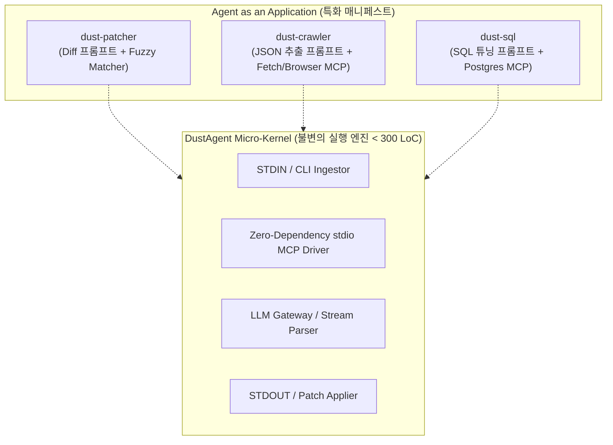
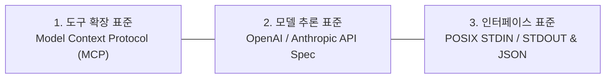

# 📦 07. Agent as an Application (AaaA) 아키텍처

> "Do one thing and do it well (한 가지만 제대로 하라)."  
> — 유닉스 철학 (Unix Philosophy)

DustAgent가 지향하는 궁극의 형태는 모든 것을 다 하려는 만능 에이전트(General-Purpose Agent)가 아닙니다.  
**"표준(MCP)을 준수하는 초경량 코어(Micro-Kernel) 위에, 특정 도메인에 특화된 스킬과 프롬프트만 얹어 단일 목적의 독립 애플리케이션으로 동작하는 모델"** — 이것이 바로 **Agent as an Application (AaaA)**입니다.

---

## 1. 왜 만능 에이전트는 실패하고, AaaA는 강력한가?

### 기존 범용 에이전트의 구조적 결함
1. **어텐션 희석 (Attention Dilution)**:
   - "너는 만능 개발자이자 비서이자 분석가야..." 식의 수천 줄 프롬프트.
   - 도구를 20~30개씩 모델에 때려 넣으면 모델이 헷갈려서 엉뚱한 도구를 호출하거나 환각을 일으킴.
2. **잡음과 과도한 상호작용 (Chatter Pollution)**:
   - 크롤링 결과만 원하는데 "네! 링크를 분석하여 결과를 정리해 드렸습니다." 같은 불필요한 서술형 텍스트를 출력.
3. **무거운 런타임**:
   - 크롤링 하나 하려고 LangChain, AutoGen 등의 수백 MB 라이브러리를 올리고 세션을 유지함.

### Agent as an Application (AaaA)의 승리 공식
* **단일 책임 원칙 (Single Responsibility)**: 크롤러 에이전트는 오직 크롤링만 수행. 패처 에이전트는 오직 코드 수정만 수행.
* **초정밀 프롬프트 (Razor-Sharp Prompt)**: 불필요한 시스템 규칙 전면 배제, 단 10~20줄의 목표 지향적 프롬프트.
* **도구 집중도 100%**: 해당 작업에 필요한 1~2개의 전용 MCP 도구만 바인딩. Tool Calling 정확도 99.9% 달성.

---

## 1.1 핵심 보안 및 성능 혁신: MCP 스코프 격리 (Anti-Pollution & Least Privilege)

기존 MCP 호스트(Claude Desktop, Cline 등)의 가장 치명적인 약점은 **"글로벌 설정에 온갖 MCP 서버를 다 등록해 두어, 모든 에이전트 실행 시 20~30개의 도구가 한꺼번에 컨텍스트에 쏟아져 들어간다"**는 점이었습니다.

이로 인해 다음과 같은 심각한 문제가 발생합니다:
1. **도구 오염 (Tool Pollution)**: 크롤링을 시켰는데 갑자기 파일 삭제 도구나 깃 커밋 도구를 건드리는 등 "엄한 짓"을 할 위험 노출.
2. **컨텍스트 토큰 낭비**: 20개 도구의 스키마를 설명하는 데만 3,000~5,000 토큰이 낭비되고 비용과 지연 시간 급증.
3. **선택 장애 (Decision Paralysis)**: 모델이 어떤 도구를 써야 할지 헷갈려 환각 발생.

> [!IMPORTANT]
> **DustAgent AaaA의 해법: 철저한 MCP 스코프 격리 (Per-App Isolation)**  
> * `dust run crawler`를 실행하면 오직 `fetch` MCP만 프로세스로 뜹니다.
> * 파일시스템이나 DB, 셸 실행 도구는 **모델의 컨텍스트(시야)에 아예 존재하지도 않습니다.**
> * 엄한 짓을 하고 싶어도 도구 자체가 없으므로 **물리적으로 부작용(Side-effect)이 0%로 원천 차단**됩니다.



---

## 2. AaaA의 2단 분리 아키텍처: Micro-Kernel + Manifest

DustAgent는 시스템을 완전히 둘로 쪼갭니다:

1. **Micro-Kernel (불변의 엔진, ~300 LoC)**:
   - LLM 통신 (OpenAI / Anthropic / Gemini 표준 프로토콜)
   - 표준 stdio JSON-RPC 2.0 MCP 클라이언트
   - 유닉스 파이프(STDIN/STDOUT) 및 에러 핸들링
2. **Application Manifest (가변의 특화 정의서, JSON/YAML)**:
   - 특화 시스템 프롬프트 (Zero-Chatter)
   - 연결할 표준 MCP 서버 목록 (스킬)
   - 기대 출력 스키마 (JSON, Diff, Markdown 등)

---

## 3. 대표적인 AaaA 예시: `dust-crawler` (특화 크롤러 에이전트)

### 매니페스트 정의: `apps/crawler.json`
```json
{
  "$schema": "dustagent/app-v1",
  "name": "dust-crawler",
  "description": "웹 URL 또는 검색어를 받아 순수 정형 데이터(JSON)로 추출하는 에이전트",
  "system_prompt": "You are a headless web crawler and extractor. Your only job is to fetch the provided URL or query, parse the core content, and output clean JSON matching the requested schema. Never output conversational pleasantries, markdown fences, or explanations. Pure JSON output only.",
  "mcp_servers": {
    "fetch": {
      "command": "uvx",
      "args": ["mcp-server-fetch"]
    }
  },
  "output_format": "raw_json"
}
```

### 실행 및 파이프라이닝
```bash
# 1. 단일 URL 크롤링 및 파싱
dust run crawler "https://news.ycombinator.com" > hn.json

# 2. 유닉스 파이프라인 결합 (jq와 연동)
dust run crawler "https://github.com/trending" | jq '.repositories[0].name'

# 3. URL 목록 일괄 처리 (Batch Processing)
cat urls.txt | while read url; do dust run crawler "$url"; done >> results.jsonl
```

---

## 4. 표준(Standard)을 지키는 3대 축

"가볍지만 표준을 지킨다"는 원칙을 구현하는 기술적 기준입니다:



1. **도구 표준 = Model Context Protocol (MCP)**:
   - 자체 독자 플러그인 규격을 만들지 않습니다.
   - 이미 오픈소스 커뮤니티에 존재하는 수백 개의 표준 MCP 서버(`mcp-server-fetch`, `mcp-server-postgres`, `puppeteer` 등)를 수정 없이 100% 즉시 스킬로 사용합니다.
2. **모델 표준 = Frontier API 표준 호환**:
   - Anthropic Messages API, OpenAI Chat Completion API 규격을 그대로 수용.
3. **입출력 표준 = POSIX I/O Streams**:
   - `STDIN`으로 들어와서 `STDOUT`으로 빠져나가는 유닉스 전통 파이프라인 완벽 지원.

---

## 5. 결론: "Agent as an Application"의 미래

* 사용자는 이제 "에이전트에게 일을 시키기 위해 대화창을 켜지 않습니다."
* 개발자는 마치 `curl`, `jq`, `sed`를 쓰듯이, **`dust-crawler`**, **`dust-patcher`**, **`dust-reviewer`**를 필요한 파이프라인에 한 줄의 커맨드로 배치합니다.
* 딴짓하지 않고, 가장 빠르고, 가장 작으며, 결과만 완벽하게 뱉어내는 진정한 소프트웨어 유틸리티가 완성됩니다.
