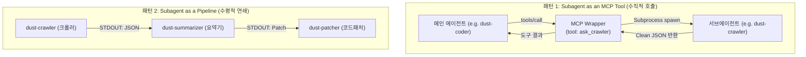

# 🧩 08. 초경량 서브에이전트 및 스킬 설계

> "서브에이전트를 위해 복잡한 프레임워크를 만들지 마라.  
> 서브에이전트는 그저 **다른 에이전트의 눈에는 하나의 MCP 도구(Tool)**이거나, **유닉스 파이프의 다음 단계**일 뿐이다."

관련 문서: [[01_개념_및_설계철학]], [[03_초경량_MCP_엔진]], [[07_Agent_as_an_Application_AaaA]]

---

## 1. Skill과 Subagent의 본질적 정의

혼란스러운 용어를 엔지니어링 관점에서 명확히 규정합니다:

```text
┌─────────────────────────────────────────────────────────────┐
│ 1. Skill (기능)     : 저수준 입출력 도구 (순수 MCP Server Tool)   │
│                       예: fetch_html(), git_diff(), query_sql()│
├─────────────────────────────────────────────────────────────┤
│ 2. Subagent (행위자): [특정 프롬프트] + [특화 Skill] + [LLM 지능]│
│                       예: dust-crawler, dust-reviewer        │
├─────────────────────────────────────────────────────────────┤
│ 3. AaaA (앱)        : CLI 또는 파이프라인으로 호출 가능한 단위   │
└─────────────────────────────────────────────────────────────┘
```

즉, **`Skill(MCP) + 특화 프롬프트 = Subagent (AaaA)`** 입니다.

---

## 2. 기존 에이전트의 실패: 왜 멀티에이전트 프레임워크는 망가지는가?

LangGraph, CrewAI, AutoGen 등의 멀티에이전트 시스템은 다음과 같은 치명적 결함을 안고 있습니다:
1. **공유 상태(Shared State)의 지옥**: 모든 에이전트가 공유 메모리/대화 히스토리에 접근하면서 토큰이 기하급수적으로 폭증.
2. **에이전트 간 수다(Agent Chatter)**: 에이전트 A와 B가 "안녕하세요", "그렇게 하겠습니다"라며 불필요한 턴을 낭비.
3. **무한 루프와 데드락**: 복잡한 라우팅 상태 머신으로 인해 종료 조건을 찾지 못함.

---

## 3. DustAgent의 2대 초경량 오케스트레이션 모델

DustAgent는 거대한 오케스트레이터를 만들지 않고, **표준 MCP와 유닉스 파이프**만으로 서브에이전트를 완벽히 해결합니다.



---

## 4. 패턴 1: Subagent as an MCP Tool (가장 우아한 방식)

부모 에이전트 입장에서 서브에이전트는 특별한 무언가가 아닙니다.  
**"그저 호출하면 결과 문자열을 뱉어주는 하나의 표준 MCP 도구"**에 불과합니다.

### 작동 메커니즘
1. 부모 에이전트(`coder`)의 매니페스트에 서브에이전트(`crawler`)를 MCP 도구로 등록:
```json
{
  "name": "coder",
  "mcp_servers": {
    "researcher_agent": {
      "command": "dust",
      "args": ["run", "crawler"]
    }
  }
}
```
2. 부모 에이전트의 LLM은 `researcher_agent`라는 도구를 일반 함수처럼 호출합니다.
3. DustAgent 코어는 자식 프로세스로 `dust run crawler "<query>"`를 띄웁니다.
4. 자식 서브에이전트는 독립된 프로세스에서 실행되어 결과를 STDOUT으로 출력하고 **즉시 프로세스가 종료(Kill)**됩니다.
5. 부모 에이전트는 깨끗한 결과 텍스트만 도구 출력으로 수신합니다.

### 이 방식의 폭발적인 장점:
* **컨텍스트 격리 (Zero Context Pollution)**: 서브에이전트가 크롤링하면서 본 수만 줄의 HTML은 서브에이전트 프로세스 안에서 소멸합니다. 부모에게는 최종 요약 데이터(몇 줄)만 전달됩니다.
* **메모리 누수 제로 (Ephemeral)**: 서브에이전트는 영구 상주하지 않고 필요할 때 떴다가 끝나면 즉시 소멸합니다.
* **무한 루프 불가**: 단발 함수 호출(Single-turn)이므로 에이전트끼리 대화하며 헛돌 일이 없습니다.

---

## 5. 패턴 2: Subagent as a Pipeline (유닉스 파이프 연쇄)

서브에이전트들이 서로를 알 필요도 없는 가장 순수한 형태입니다. 유닉스 파이프로 연결합니다:

```bash
# 1. 크롤러 서브에이전트가 공식 문서를 긁어옴
# 2. 번역 서브에이전트가 한국어로 정제
# 3. 문서 패처 서브에이전트가 README.md에 삽입
dust run crawler "https://docs.anthropic.com/en/docs/mcp" \
  | dust run translator \
  | dust patch -f README.md "문서 섹션에 번역본 추가"
```

각 에이전트는 오직 자기 앞의 STDIN과 자기 뒤의 STDOUT만 바라보므로 복잡도가 $O(1)$로 유지됩니다.

---

## 6. 결론: "스킬 서브에이전트"의 공식

1. **스킬(Skill)을 만들고 싶다** $\rightarrow$ 표준 MCP Server 하나를 만든다 (예: DB 쿼리 도구).
2. **서브에이전트(Subagent)를 만들고 싶다** $\rightarrow$ 그 MCP Server에 전용 프롬프트를 얹어 `apps/my-subagent.json` 매니페스트를 선언한다.
3. **상위 에이전트가 서브에이전트를 부르게 하고 싶다** $\rightarrow$ 그 서브에이전트의 CLI 실행 명령을 상위 에이전트의 `mcp_servers`에 도구로 등록한다.

이렇게 하면 프레임워크 코드 한 줄 추가 없이도 **무한한 계층의 전문 서브에이전트 트리**를 구축할 수 있습니다.
