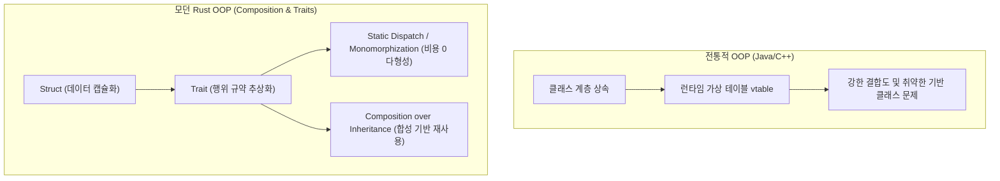

# 🦀 09. Rust 개발 국룰 및 OOP/유지보수성 아키텍처 가이드

> "Rust에서 Java식 객체지향을 흉내 내지 마라.  
> 상속 대신 합성(Composition), 런타임 다형성 대신 제로비용 정적 디스패치, 타입 시스템을 통한 불변식 보장이 진정한 Rust의 객체지향이다."

관련 문서: [[01_개념_및_설계철학]], [[02_시스템_아키텍처]], [[06_구현_로드맵_및_기술스택]], [[07_Agent_as_an_Application_AaaA]]

---

## 1. Rust 생태계 "국룰" 기술 스택 (De-Facto Standard Crates)

Rust로 CLI 및 에이전트 시스템을 구축할 때 커뮤니티에서 사실상의 표준(Standard)으로 통용되는 크레이트 조합입니다:

| 영역 | 국룰 크레이트 | 도입 사유 및 Best Practice |
| :--- | :--- | :--- |
| **CLI 파싱** | **`clap` (feature = ["derive"])** | 타입 안전한 선언형 Struct 기반 파싱. CLI 산업 표준 |
| **직렬화** | **`serde`, `serde_json`** | Zero-copy 역직렬화, JSON-RPC 및 매니페스트 파싱 |
| **비동기 런타임** | **`tokio` (features = ["full"])** | Subprocess stdio 파이프 비동기 제어 및 타이머 |
| **HTTP 클라이언트**| **`reqwest` (features = ["json"])** | LLM API 통신 (OpenAI, Anthropic 등) |
| **에러 핸들링 (Core)** | **`thiserror`** | 코어 라이브러리 내부의 명확하고 타입 안전한 Enum 에러 정의 |
| **에러 핸들링 (CLI)** | **`anyhow`** | `main.rs` 애플리케이션 레벨의 간결한 에러 전파 및 컨텍스트 부착 |
| **관측성 / 로깅** | **`tracing`, `tracing-subscriber`** | 구조화된 로그. **반드시 `stderr`로 출력**하여 유닉스 파이프(`stdout`) 오염 방지 |

---

## 2. Rust 스타일 객체지향 프로그래밍 (Idiomatic Rust OOP)

Rust에는 `class`와 `extends`가 없습니다. 그러나 객체지향의 본질인 **캡슐화(Encapsulation)**, **추상화(Abstraction)**, **다형성(Polymorphism)**은 더 엄격하고 안전하게 구현됩니다.



### ① 캡슐화 (Encapsulation): Struct + 불변 생성자
모든 필드는 `pub`으로 열지 않고 비공개(`private`)로 유지하며, 생성자 함수(`new`)를 통해 도메인 불변식(Invariant)을 강제합니다:

```rust
pub struct SearchReplaceBlock {
    search: String,
    replace: String,
}

impl SearchReplaceBlock {
    // 빈 검색 블록 생성을 컴파일/런타임 원천 차단
    pub fn new(search: impl Into<String>, replace: impl Into<String>) -> Result<Self, PatchError> {
        let search = search.into();
        if search.trim().is_empty() {
            return Err(PatchError::EmptySearchBlock);
        }
        Ok(Self { search, replace: replace.into() })
    }

    pub fn search(&self) -> &str { &self.search }
    pub fn replace(&self) -> &str { &self.replace }
}
```

### ② 다형성 (Polymorphism): Static Dispatch 우선 원칙
`Box<dyn Trait>`(동적 디스패치)를 남발하면 포인터 역참조 비용과 인라인 최적화 불가 문제가 발생합니다.  
Rust의 국룰은 **제네릭(`impl Trait` / `<T: LlmProvider>`) 기반 정적 디스패치**를 기본으로 삼는 것입니다:

```rust
// 1. 추상화 규약 (Trait / Port)
pub trait LlmProvider: Send + Sync {
    async fn generate(&self, prompt: &str) -> Result<String, LlmError>;
}

// 2. 구현체 (Adapters)
pub struct OpenAiProvider { /* ... */ }
pub struct AnthropicProvider { /* ... */ }

// 3. 제로비용 정적 디스패치 (컴파일러가 인라인 최적화)
pub struct DustCore<P: LlmProvider> {
    provider: P,
}
```

### ③ Type-State 패턴 (잘못된 상태 전이 컴파일 타임 차단)
빌더 패턴과 상태 머신을 결합하여, 설정이 누락된 에이전트가 실행되는 실수를 컴파일 타임에 잡습니다:

```rust
pub struct Unconfigured;
pub struct Configured;

pub struct AgentBuilder<State> {
    manifest_path: Option<PathBuf>,
    state: std::marker::PhantomData<State>,
}

impl AgentBuilder<Unconfigured> {
    pub fn with_manifest(self, path: PathBuf) -> AgentBuilder<Configured> {
        AgentBuilder { manifest_path: Some(path), state: std::marker::PhantomData }
    }
}

impl AgentBuilder<Configured> {
    pub fn build(self) -> DustAgent { /* ... */ }
}
```

---

## 3. 유지보수성을 극대화하는 프로젝트 디렉토리 구조 (Library-First)

Rust CLI 프로젝트의 정석은 **"코어 비즈니스 로직은 `lib.rs`로 완전 격리하고, `main.rs`는 단순 어댑터로 남기는 것"**입니다.

```text
/storage_0/dustagent-rs/
├── Cargo.toml               # 워크스페이스 및 의존성 정의
├── src/
│   ├── lib.rs               # [코어 라이브러리] 외부 크레이트나 통합 테스트에서 호출 가능
│   ├── main.rs              # [CLI 진입점] clap 파싱 및 lib 호출만 담당 (Composition Root)
│   │
│   ├── domain/              # 1. 도메인 계층 (외부 의존성 제로의 순수 엔티티)
│   │   ├── mod.rs
│   │   ├── manifest.rs      # AppManifest, McpConfig
│   │   └── patch.rs         # PatchBlock, LineRange
│   │
│   ├── ports/               # 2. 포트 계층 (인터페이스/Trait 정의)
│   │   ├── mod.rs
│   │   ├── llm.rs           # LlmProvider trait
│   │   ├── mcp.rs           # McpTransport trait
│   │   └── patcher.rs       # CodePatcher trait
│   │
│   ├── adapters/            # 3. 어댑터 계층 (Trait의 구체적 구현체)
│   │   ├── mod.rs
│   │   ├── mcp_stdio.rs     # Tokio Subprocess stdio JSON-RPC 클라이언트
│   │   ├── openai.rs        # Reqwest 기반 OpenAI 어댑터
│   │   └── fuzzy_patch.rs   # 4단계 Fuzzy Whitespace Normalizer
│   │
│   ├── application/         # 4. 애플리케이션 계층 (유스케이스 오케스트레이션)
│   │   ├── mod.rs
│   │   └── core.rs          # DustCore 파이프라인 조립
│   │
│   └── error.rs             # thiserror 기반 전체 도메인 에러 트리
└── tests/                   # 통합 테스트 (Integration Tests)
    ├── patch_tests.rs
    └── mcp_tests.rs
```

---

## 4. Rust 코드 품질 강제 (국룰 린팅 & 포매팅)

개발 시 CI/CD 및 로컬에서 반드시 통과해야 하는 4대 명령:

```bash
# 1. 코드 스타일 표준 준수
cargo fmt --all -- --check

# 2. 강력한 관용적(Idiomatic) 코드 정적 분석
cargo clippy --all-targets --all-features -- -D warnings

# 3. 단위 및 통합 테스트
cargo test

# 4. 릴리스 빌드 최적화 (단일 바이너리 용량 3~5MB 수준으로 압축)
cargo build --release
```

### `Cargo.toml` 릴리스 최적화 프로파일 설정 (최소 바이너리 & 최고 속도)
```toml
[profile.release]
opt-level = 3          # 최고 수준 최적화
lto = true             # Link-Time Optimization (미사용 코드 전역 제거)
codegen-units = 1      # 단일 코드젠 유닛으로 인라인 최적화 극대화
panic = "abort"        # 스택 언와인딩 제거로 바이너리 크기 대폭 감소
strip = true           # 디버그 심볼 제거 (바이너리 크기 70% 감소)
```

---

## 5. 결론: DustAgent-RS 구현 지침

1. **상속이 아닌 합성(Trait Composition)**으로 코어를 모듈화하여, LLM 공급자나 MCP 전송 방식을 손쉽게 갈아 끼울 수 있도록 설계합니다.
2. 코어 비즈니스 로직(`lib.rs`)은 I/O와 분리되어 **100% 모의(Mock) 테스트 가능**해야 합니다.
3. 컴파일러의 소유권과 타입 시스템을 무기로 삼아 **런타임 크래시가 0에 수렴하는 단일 5MB 네이티브 바이너리**를 산출합니다.
