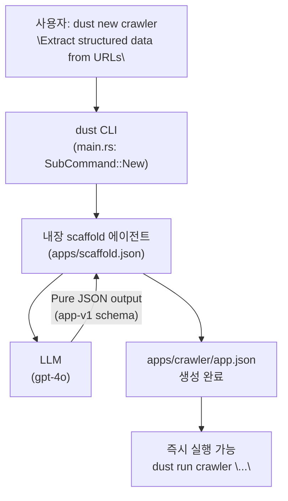
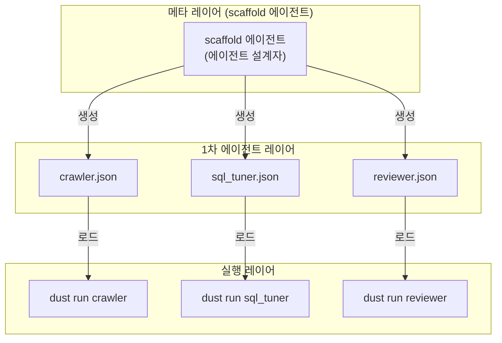

# 🏗️ 10. `dust new` — 에이전트가 에이전트를 만드는 스캐폴딩

> "도구를 직접 쓰려고요? 에이전트한테 시키세요."  
> — DustAgent 핵심 철학

관련 문서: [[07_Agent_as_an_Application_AaaA]], [[05_인터페이스_및_CLI_스펙]], [[08_초경량_서브에이전트_및_스킬_설계]]

---

## 1. `dust new`란 무엇인가?

`dust new`는 **새로운 AaaA 에이전트 매니페스트(`apps/<name>/app.json`)를 생성하는 메타 명령어**입니다.

그런데 핵심은 여기에 있습니다: `dust new`는 단순한 템플릿 복사가 아닙니다.  
**`dust new` 자체가 하나의 내장 AaaA 에이전트 — `scaffold` 에이전트 — 를 실행합니다.**

즉, 에이전트가 에이전트를 설계하는 **메타(Meta) 구조**입니다.

```
사용자 → dust new [이름] "[설명]" → scaffold 에이전트(LLM) → apps/[이름]/app.json
```

`dust new crawler "Extract structured data from URLs as JSON"` 한 줄이면:

1. 내장 `scaffold` 에이전트가 활성화됩니다.
2. LLM이 설명 문자열을 분석하여 적합한 시스템 프롬프트, MCP 서버 조합, 출력 포맷을 **스스로 결정**합니다.
3. 완성된 `apps/crawler/app.json`이 생성됩니다.
4. 즉시 `dust run crawler "..."` 가 가능해집니다.

---

## 2. scaffold 에이전트의 구조 (메타 AaaA)

`scaffold` 에이전트는 `apps/scaffold.json`에 정의된 일반적인 AaaA 에이전트입니다.  
특별한 점은 그 **출력물이 다른 에이전트의 매니페스트 파일**이라는 것입니다.

```json
{
  "$schema": "dustagent/app-v1",
  "name": "scaffold",
  "description": "Design a new DustAgent app manifest from a natural-language description",
  "default_model": "gpt-4o",
  "system_prompt": "You are a DustAgent app architect. Given an agent name and a one-line description, produce a complete apps/<name>/app.json manifest.\n\nRules:\n1. Output ONLY valid JSON matching the dustagent/app-v1 schema. No markdown fences. No explanation.\n2. Write a system_prompt that is laser-focused: single responsibility, zero-chatter, output-format explicit.\n3. Select the minimum viable set of mcp_servers needed for the task. If no external tool is required, output an empty object {}.\n4. Choose output_format: 'raw_json' for structured data, 'text' for prose, 'search_replace_patch' for SEARCH/REPLACE code patches.\n5. Never add mcp_servers that are not strictly necessary.",
  "mcp_servers": {},
  "output_format": "raw_json"
}
```

`scaffold` 에이전트 자체는 외부 MCP 도구가 없습니다 (`"mcp_servers": {}`).  
순수한 LLM 추론만으로 매니페스트를 설계합니다 — 최소 도구 원칙의 모범 사례입니다.

---

## 3. 동작 원리 단계별 흐름



### 상세 단계

1. **CLI 진입점**: `dust new <name> "<description>"` 명령이 파싱됩니다.
2. **scaffold 에이전트 로드**: `apps/scaffold.json` 매니페스트가 micro-kernel에 로드됩니다.
3. **컨텍스트 주입**: 사용자가 입력한 `name`과 `description`이 STDIN으로 scaffold 에이전트에 전달됩니다.
4. **LLM 추론**: scaffold 에이전트의 LLM이 app-v1 스키마에 맞는 JSON 매니페스트를 생성합니다.
5. **파일 저장**: 출력된 JSON이 `apps/<name>/app.json`에 저장됩니다.
6. **즉시 실행**: 컴파일 없이 바로 `dust run <name>`이 가능합니다.

---

## 4. 예시: `dust new`로 다양한 에이전트 생성

### 예시 1: 웹 크롤러 에이전트

```bash
dust new crawler "Extract structured data from URLs as JSON"
```

생성 결과 (`apps/crawler/app.json`):
```json
{
  "$schema": "dustagent/app-v1",
  "name": "crawler",
  "description": "Extract structured data from URLs as JSON",
  "default_model": "gpt-4o-mini",
  "system_prompt": "You are a headless web extractor. Receive a URL via STDIN. Fetch its content using the fetch tool and output clean, structured JSON representing the core data. No markdown. No explanation. Pure JSON only.",
  "mcp_servers": {
    "fetch": {
      "command": "uvx",
      "args": ["mcp-server-fetch"]
    }
  },
  "output_format": "raw_json"
}
```

### 예시 2: SQL 성능 튜너 에이전트

```bash
dust new sql_tuner "Analyze PostgreSQL EXPLAIN plans and suggest index optimizations"
```

생성 결과 (`apps/sql_tuner/app.json`):
```json
{
  "$schema": "dustagent/app-v1",
  "name": "sql_tuner",
  "description": "Analyze PostgreSQL EXPLAIN plans and suggest index optimizations",
  "default_model": "gpt-4o",
  "system_prompt": "You are a PostgreSQL performance expert. Receive a slow query or EXPLAIN ANALYZE output via STDIN. Output ONLY optimized SQL statements and CREATE INDEX recommendations as raw SQL. No prose. No markdown.",
  "mcp_servers": {},
  "output_format": "text"
}
```

### 예시 3: 코드 리뷰어 에이전트

```bash
dust new reviewer "Review a git diff for bugs, security issues, and style violations"
```

생성 결과 (`apps/reviewer/app.json`):
```json
{
  "$schema": "dustagent/app-v1",
  "name": "reviewer",
  "description": "Review a git diff for bugs, security issues, and style violations",
  "default_model": "gpt-4o",
  "system_prompt": "You are a strict code reviewer. Receive a git diff via STDIN. Output a JSON array of review comments, each with: {\"file\", \"line\", \"severity\": \"error\"|\"warning\"|\"info\", \"message\"}. No conversational text.",
  "mcp_servers": {},
  "output_format": "raw_json"
}
```

바로 파이프라인에 투입:
```bash
git diff HEAD~1 | dust run reviewer | jq '.[] | select(.severity == "error")'
```

---

## 5. 메타 AaaA 패턴: 에이전트가 에이전트를 만드는 재귀 구조

`dust new`가 보여주는 패턴은 **DustAgent의 철학을 스스로 증명**합니다:

> "에이전트를 만들고 싶을 때, 그 설계 작업도 에이전트한테 시킨다."

이것이 **메타 AaaA(Meta Agent-as-an-Application)**입니다.



이 패턴의 핵심 특성:

| 특성 | 설명 |
| :--- | :--- |
| **재귀성 (Recursion)** | scaffold 에이전트 자신도 `apps/scaffold.json` 매니페스트로 정의됨 |
| **자가 확장성 (Self-Extension)** | 새 에이전트 추가 = 새 JSON 파일 하나, 코드 변경 없음 |
| **단일 책임 유지** | scaffold는 오직 '에이전트 설계'만 수행, 실행은 다른 에이전트가 담당 |
| **Zero Interaction** | 사용자는 한 줄 명령만 입력, 이후 모든 설계는 LLM이 자율 수행 |

---

## 6. `dust new` vs 수동 작성

| | `dust new` | 수동 작성 |
| :--- | :---: | :---: |
| **소요 시간** | ~3초 (LLM 추론) | 5~30분 |
| **프롬프트 품질** | LLM이 도메인 전문가 수준으로 최적화 | 작성자 실력에 의존 |
| **MCP 선택** | 자동 (필요한 것만) | 직접 검색 및 판단 |
| **스키마 준수** | 항상 유효한 app-v1 JSON | 직접 검증 필요 |
| **반복 실험** | `dust new`를 다시 실행하면 됨 | 파일을 직접 편집 |

---

## 7. 고급: scaffold 에이전트 커스터마이징

`apps/scaffold.json`을 직접 수정하여 조직의 표준을 반영할 수 있습니다:

```json
{
  "$schema": "dustagent/app-v1",
  "name": "scaffold",
  "description": "...",
  "system_prompt": "...\n\n조직 표준:\n- 모든 에이전트는 default_model을 'claude-3-5-sonnet-20241022'로 설정할 것.\n- output_format은 항상 'raw_json'으로 설정할 것 (파이프라인 연동 표준).\n- mcp_servers에 내부 DB MCP(command: 'dust-internal-mcp')를 항상 포함할 것.",
  ...
}
```

scaffold 에이전트 자체가 JSON 파일이므로, **조직의 에이전트 설계 표준을 코드가 아닌 프롬프트로 관리**할 수 있습니다.

---

> [!TIP]
> **처음부터 완벽할 필요 없습니다.** `dust new`로 초안을 만들고, 부족한 부분만 `apps/<name>/app.json`을 직접 편집하는 방식이 가장 효율적입니다. scaffold 에이전트는 80%의 반복 설계 작업을 대신합니다.

> [!IMPORTANT]
> **`dust new`가 생성한 에이전트를 실제로 실행하기 전에 `apps/<name>/app.json`을 한 번 검토하세요.** 특히 `mcp_servers`에 선택된 외부 도구가 예상과 일치하는지 확인하는 것이 보안과 비용 관리의 기본입니다.

현재 dust new는 package 메타데이터와 빈 skills/ 디렉터리도 생성한다. 기존 디렉터리는 덮어쓰지 않는다. --stdout은 파일을 만들지 않고 메타데이터를 포함한 JSON만 출력한다. skill 작성과 배포는 [[14_앱_패키지_및_스킬]]를 참고한다.
