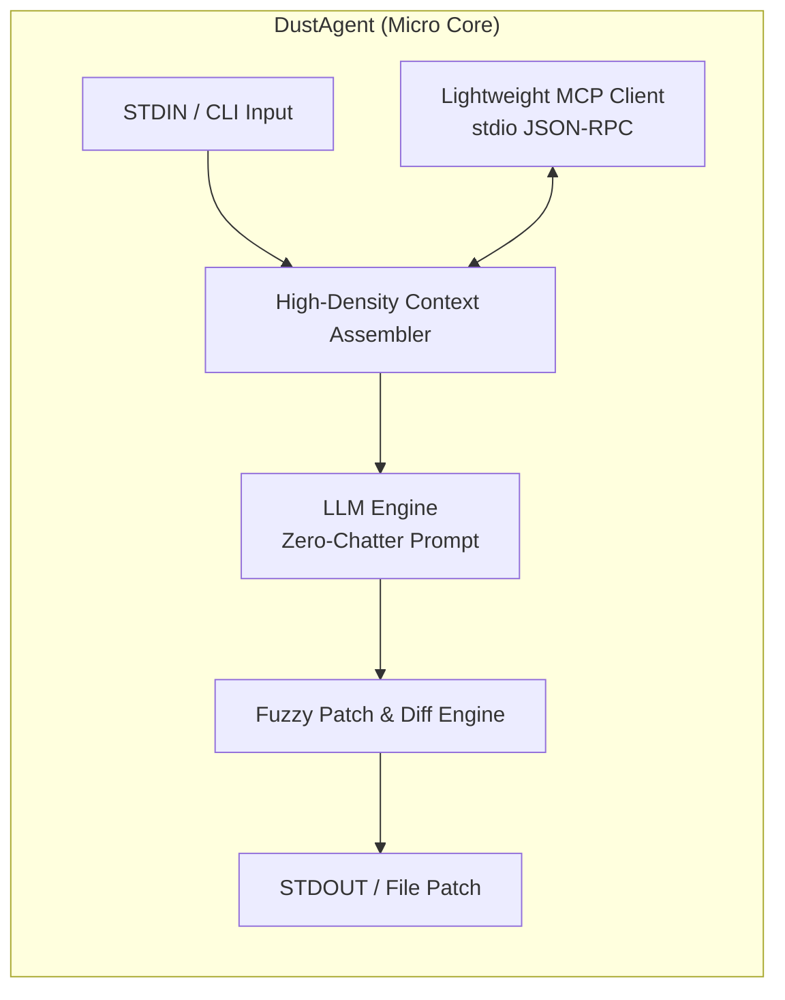

# 🌌 DustAgent (먼지 에이전트) Knowledge Base

> **"가장 작고, 가장 빠르며, 아무런 잡담 없이 코드만을 벼려내는 극한의 경량 인라인 에이전트"**

DustAgent는 OpenCode, Codex, Claude Code, Cursor, Aider 등의 핵심 강점만을 추출하여 **인터랙션 없는 순수 인입/산출(Pure I/O)** 및 **초경량 MCP(Model Context Protocol)** 지원을 목표로 설계된 마이크로 코딩 에이전트입니다.

---

## 🗺️ 문서 맵 (Map of Content)

### 1. DustAgent 핵심 설계
* [[01_개념_및_설계철학]]: 왜 초경량인가? Zero-interaction, Pure I/O 철학과 고밀도 컨텍스트 주입 원칙
* [[02_시스템_아키텍처]]: 3단계 파이프라인(Input -> Context/MCP -> LLM -> Patch -> Output)
* [[03_초경량_MCP_엔진]]: 표준 JSON-RPC 2.0 stdio 기반 Zero-Dependency MCP 클라이언트 설계
* [[04_인라인_패치_및_수정_엔진]]: Search/Replace 블록 프로토콜 및 오차 허용 Fuzzy Whitespace Matcher
* [[05_인터페이스_및_CLI_스펙]]: STDIN/STDOUT 파이프, CLI 플래그, IDE/에디터 플러그인 통합 프로토콜
* [[06_구현_로드맵_및_기술스택]]: 기술 스택(Python/Rust) 선정 및 단계별 구현 로드맵
* [[07_Agent_as_an_Application_AaaA]]: 유닉스 철학 기반 마이크로커널 + 특화 스킬 매니페스트 아키텍처
* [[08_초경량_서브에이전트_및_스킬_설계]]: Subagent as an MCP Tool 및 유닉스 파이프라인 연쇄 오케스트레이션
* [[09_Rust_개발_국룰_및_OOP_아키텍처_가이드]]: Idiomatic Rust OOP 패턴, De-facto 크레이트, Clean Architecture 구조 및 최적화 기법

### 2. 경쟁사 심층 분석 (Competitor Deep Dive)
* [[경쟁사분석/index|경쟁사 분석 종합 포털]]
* [[경쟁사분석/01_OpenCode_및_OpenInterpreter_분석|01. OpenCode & Open Interpreter 분석]]: 터미널 REPL과 프로젝트 기반 에이전트의 한계
* [[경쟁사분석/02_OpenAI_Codex_및_Copilot_분석|02. OpenAI Codex & Copilot 분석]]: Fill-in-the-Middle(FIM)과 인라인 편집의 기원
* [[경쟁사분석/03_Anthropic_Claude_Code_분석|03. Anthropic Claude Code 분석]]: Terminal-native 에이전트 루프와 공식 MCP 호스트 아키텍처
* [[경쟁사분석/04_Aider_분석|04. Aider 분석]]: SOTA 패치 벤치마크, Search/Replace Diff, Tree-sitter Repo-map
* [[경쟁사분석/05_Cursor_및_기타도구(Cline,Continue)_분석|05. Cursor & 기타 오픈소스 분석]]: Fast Apply, Shadow Workspace, Cline의 ReAct/MCP 구조
* [[경쟁사분석/06_종합_비교매트릭스_및_DustAgent_차별화_전략|06. 종합 비교 매트릭스 및 DustAgent 차별화 전략]]: 승리 공식 도출

---

## ⚡ 핵심 스펙 요약

| 항목 | 목표치 | 비고 |
| :--- | :--- | :--- |
| **바이너리/스크립트 크기** | < 1MB (또는 단일 파이썬 파일) | 불필요한 프레임워크 전면 배제 |
| **실행 시작 지연(Cold Start)** | < 30ms | 즉각적인 파이프라이닝 가능 |
| **사용자 인터랙션** | **0회 (Zero-Interaction)** | CLI 인입 -> 즉시 산출 -> 프로세스 종료 |
| **MCP 지원** | JSON-RPC 2.0 stdio 클라이언트 내장 | 외부 도구/컨텍스트 즉시 확장 가능 |
| **패치 성공률** | 98%+ (Aider 벤치마크 수준) | Fuzzy whitespace + Levenshtein fallback |

---
> [!TIP]
> Obsidian 그래프 뷰(Graph View)에서 `[[문서명]]` 링크를 통해 전체 아키텍처와 경쟁사 기술 간의 연결 고리를 시각적으로 탐색할 수 있습니다.

## 사례 기반 강화

- [[11_경험_기반_자기강화]] — 실행 기록, 자동 사례 조사·선별 및 few-shot 재사용

- [[12_실행_종료_및_시간_예산]] — 종료 사유, 도구 증거, 시간 제한 및 결과 검사

- [[13_체크포인트_및_재개]] — 대화 저장, 프로세스 재시작 후 재개 및 도구 실행 중단 경계

- [[14_앱_패키지_및_스킬]] — 앱 소유 skill, 로컬 패키지 배포와 설치 없는 실행

- [[15_완료_피드백_및_실행_복구]] — 검사 피드백, 모델 요청 재시도와 실행별 작업 메모

- [[16_ACP_인터페이스]] — ACP stdio 서버, 지속 대화, 세션 격리와 취소

- [[17_Codex_인증_및_모델_연결]] — 자동 provider 선택, Codex 캐시와 토큰 갱신
