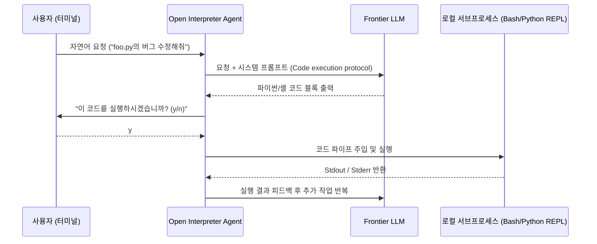

# 🔎 01. OpenCode 및 Open Interpreter 심층 분석

> 관련 문서: [[경쟁사분석/index|경쟁사 분석 MOC]], [[01_개념_및_설계철학]], [[04_인라인_패치_및_수정_엔진]]

OpenCode와 Open Interpreter는 로컬 머신에서 LLM이 직접 코드를 작성하고 실행하는 터미널 중심의 오픈소스 에이전트입니다.

---

## 1. 기본 아키텍처 및 동작 원리

Open Interpreter / OpenCode의 핵심은 **"REPL(Read-Eval-Print Loop) 기반의 시스템 자동화"**입니다.



---

## 2. 파일 수정(Editing) 구현 방식 분석

OpenCode류의 도구들이 파일을 수정하는 방식은 크게 세 가지로 나뉩니다:

### 1) Bash 스크립트 실행을 통한 파일 덮어쓰기
```bash
cat << 'EOF' > foo.py
def new_function():
    pass
EOF
```
* **문제점**: 파일 전체를 다시 작성하므로 대용량 파일에서 치명적입니다. 코드 누락(`... rest of code ...`) 환각이 빈번하게 발생합니다.

### 2) Python 스크립트 내부 인메모리 수정
```python
with open('foo.py', 'r') as f:
    content = f.read()
# 정규식 치환 후 재저장
with open('foo.py', 'w') as f:
    f.write(content.replace('old', 'new'))
```
* **문제점**: 단순 문자열 치환은 동일한 패턴이 여러 번 등장할 경우 엉뚱한 위치를 덮어씁니다.

### 3) 사용자 승인 기반의 터미널 Diff UI
* 수정 완료 후 `git diff`를 터미널에 띄우고 사용자가 승인할지 묻는 구조.
* 에디터 내부에서 작업 중인 개발자의 워크플로우를 심각하게 단절시킵니다.

---

## 3. 핵심 한계점 (왜 인라인에 부적합한가?)

1. **상호작용 강제 (Interactive Overhead)**:
   - "사용자 확인(Confirm)" 없이는 한 발짝도 나아가지 못하도록 기본 설계되어 있어, 스크립팅이나 IDE 단축키 연동이 매우 어렵습니다.
2. **인라인 Diff 미지원**:
   - 커서(Cursor)나 Aider처럼 파일의 특정 라인만을 외과수술적으로 도려내어 교체하는 정밀한 패치 알고리즘이 결여되어 있습니다.
3. **비대한 런타임**:
   - Python 패키지 의존성(수십 개)으로 인해 프로세스 구동에만 수 초가 소요됩니다.

---

## 4. DustAgent 설계에 주는 시사점

* **버려야 할 것**:
  - REPL 세션 유지 오버헤드
  - 터미널 상의 "실행하시겠습니까? (y/n)" 질의 루프
  - 전체 파일 재작성 방식
* **취해야 할 것**:
  - 터미널 및 CLI 친화적인 도구 호출 감각
  - 독립된 실행 프로세스 형태
