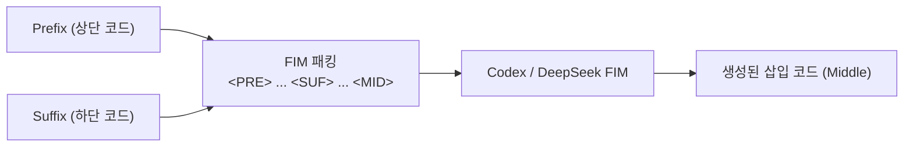

# 🤖 02. OpenAI Codex 및 GitHub Copilot 심층 분석

> 관련 문서: [[경쟁사분석/index|경쟁사 분석 MOC]], [[01_개념_및_설계철학]], [[04_인라인_패치_및_수정_엔진]]

OpenAI Codex와 GitHub Copilot은 오늘날 AI 인라인 코드 작성의 시초이자, 실시간 인라인 자동완성의 표준을 정립한 시스템입니다.

---

## 1. Fill-in-the-Middle (FIM) 메커니즘

초기 언어 모델은 오직 앞부분의 텍스트를 보고 뒷부분을 예측하는(Causal Language Modeling) 방식만 가능하여, 코드 중간 삽입 시 하단 컨텍스트(Suffix)를 인지하지 못했습니다.

OpenAI는 이를 해결하기 위해 **FIM(Fill-in-the-Middle)** 학습 기법을 도입했습니다:

```text
[입력 데이터 포맷]
<PRE> {커서 이전 코드 (Prefix)} <SUF> {커서 이후 코드 (Suffix)} <MID>
```



* **장점**: 커서 앞뒤 문맥을 동시에 고려하므로 괄호 닫기, 함수 시그니처 매칭 등이 매우 정교함.
* **레이턴시**: 스트리밍을 통해 첫 번째 토큰이 100~300ms 이내에 도달 (Ghost Text 렌더링).

---

## 2. GitHub Copilot Inline Edit (Cmd+I) 동작 방식

단순 자동완성을 넘어선 인라인 수정(Inline Edit) 기능의 흐름:
1. 사용자가 에디터에서 코드 블록을 선택(Selection)하고 자연어 명령 입력.
2. Copilot은 `Prompt` + `Selection` + `File Context`를 조립하여 모델에 전달.
3. 모델이 수정한 코드 블록 전체를 반환하면, VS Code 내부의 Diff 에디터(Inline Diff Viewer)를 통해 수락/거절 UI를 렌더링.

---

## 3. 핵심 한계점

| 항목 | Codex / Copilot Inline | DustAgent가 요구하는 수준 |
| :--- | :--- | :--- |
| **추론 능력** | 경량 자동완성 모델 중심 (복잡한 로직 한계) | 최상위 프론티어 모델 (Claude 3.5 Sonnet / GPT-4o) |
| **외부 도구(MCP)** | 폐쇄적 (외부 DB, API 등 접근 불가) | **표준 MCP 완벽 지원** |
| **환경 독립성** | VS Code 등 공식 지원 IDE 종속 | **터미널, 셸, Neovim, 어디서나 동작하는 CLI** |
| **수정 범위** | 커서 주변 단일 블록 위주 | 파일 내 다중 블록 동시 치환 가능 |

---

## 4. DustAgent 설계에 주는 시사점

* **취해야 할 핵심 기법**:
  - **Surrounding Context Window**: 타깃 블록의 Prefix(상단 30줄)와 Suffix(하단 30줄)를 고밀도로 추출하여 모델에 먹이는 FIM식 컨텍스트 주입 기법을 차용.
* **보완해야 할 점**:
  - 단순 코드 채우기가 아닌, 자연어 지시어를 정확히 반영하는 Search/Replace 블록 프로토콜 결합.
