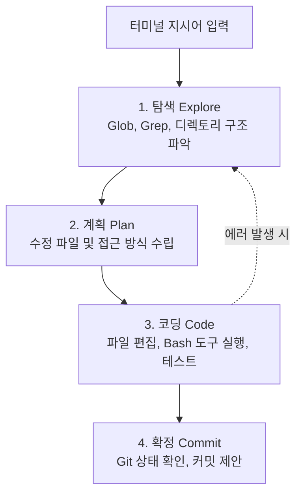
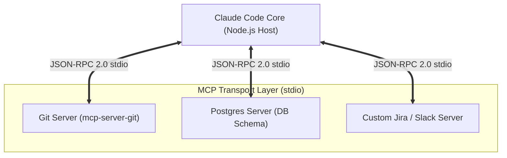

# 🧠 03. Anthropic Claude Code 심층 분석

> 관련 문서: [[경쟁사분석/index|경쟁사 분석 MOC]], [[01_개념_및_설계철학]], [[03_초경량_MCP_엔진]]

Claude Code는 Anthropic이 공식 발표한 터미널 네이티브 자율 코딩 에이전트로, **Model Context Protocol(MCP)을 핵심 확장 아키텍처로 전면 채택**한 최초의 1군 에이전트 CLI입니다.

---

## 1. 아키텍처 및 에이전트 루프

Claude Code는 개발자가 터미널에서 내린 자연어 지시를 수행하기 위해 4단계 자율 에이전트 루프(Agentic Loop)를 순환합니다:

### 내장 도구 세트 (Native Tools)
* `View / Edit`: 파일 읽기 및 특정 블록 수정
* `Bash`: 터미널 명령어 실행 (빌드, 테스트, linter 구동)
* `Glob / Grep`: 코드베이스 고속 검색

---

## 2. Model Context Protocol (MCP) 구현 구조

Claude Code의 가장 큰 기술적 특징은 외부 도구/데이터베이스 연동을 독자 API가 아닌 **MCP 표준 클라이언트**로 일원화했다는 점입니다.

* **설정 계층 구조**:
  - 프로젝트 단위: `./.mcp.json` (팀원 간 형상 관리 가능)
  - 글로벌 사용자 단위: `~/.claude/mcp.json`
* **도구 발견(Discovery) & 라우팅**:
  - 프로세스 시작 시 `tools/list`를 호출하여 도구 명세를 프롬프트의 Tool schema에 주입.
  - 모델의 Tool Call 발생 시 stdio를 통해 해당 MCP 서버로 메시지 포워딩.

---

## 3. 핵심 한계점 (왜 더 가벼워져야 하는가?)

1. **상호작용성(Interactive) 오버헤드**:
   - Claude Code는 대화형 터미널 챗 앱입니다. 사용자의 중간 응답을 기다리고, 확인을 구하는 과정이 잦아 자동화 파이프라인이나 에디터 단축키로 쓰기에는 너무 무겁습니다.
2. **비대한 번들과 느린 구동**:
   - 대규모 TypeScript/Node.js 번들로 빌드되어 있어, 명령어 실행 후 초기 프롬프트가 뜨기까지 1~2초 이상의 지연이 발생합니다.
3. **토큰 소모량 과다**:
   - Agentic loop가 여러 차례 돌며 중간 컨텍스트가 쌓여 작은 함수 하나를 고치는 데도 수만 토큰이 소모될 수 있습니다.

---

## 4. DustAgent 설계에 주는 시사점

> [!IMPORTANT]
> **DustAgent가 흡수할 결정적 자산**:
> 1. **`.mcp.json` 설정 표준을 100% 호환**하여, 기존 Claude Code 사용자가 설정 파일 그대로 DustAgent를 즉시 사용할 수 있도록 지원.
> 2. 그러나 Node.js 런타임 대신 **초경량 stdio 드라이버**를 탑재하여 구동 시간을 10ms 단위로 단축.
> 3. 에이전트 루프를 **Single-Shot Pure I/O**로 압축하여 토큰 소모를 90% 이상 절감.
