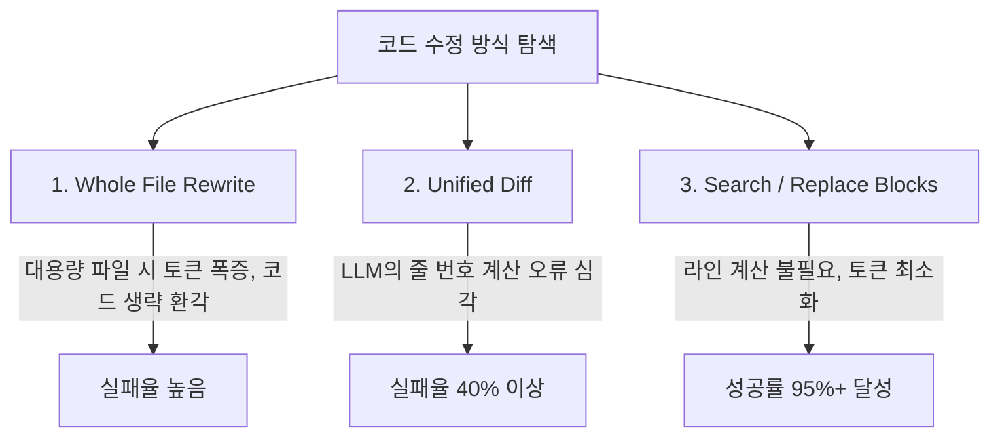

# 🏆 04. Aider 심층 분석 (코딩 에이전트 SOTA의 원천)

> 관련 문서: [[경쟁사분석/index|경쟁사 분석 MOC]], [[01_개념_및_설계철학]], [[04_인라인_패치_및_수정_엔진]]

Aider는 Paul Gauthier가 제작한 오픈소스 코딩 도구로, SWE-bench 및 자체 편집 벤치마크에서 **오랫동안 압도적 1위를 유지하며 현대 코딩 에이전트의 '패치 엔지니어링 표준'을 정립한 시스템**입니다.

---

## 1. 파일 편집 포맷의 진화와 Aider의 발견

Aider 프로젝트는 수천 번의 벤치마크를 통해 다양한 LLM 코드 편집 방식을 정량 비교했습니다:

### Aider의 결론: Search/Replace 블록이 유일한 해법
* LLM은 절대 줄 번호(Line Numbers)를 정확히 세지 못합니다 (`@@ -120,8 +120,10 @@`).
* 원본 코드의 일부를 그대로 인용하는 `SEARCH` 블록과 변경할 `REPLACE` 블록만을 요구하는 방식이 환각률을 0으로 낮추는 핵심이었습니다.

---

## 2. Aider의 핵심 엔지니어링 자산

### 1) Multi-pass Fuzzy Matching
LLM이 원본 코드를 가져올 때 들여쓰기 공백 수나 탭 문자, trailing space를 미세하게 변형하는 문제가 있습니다.
* Aider는 문자열 일치가 실패하면:
  1. 공백 제거 라인 비교 (Stripped Comparison)
  2. 선두 들여쓰기 정규화 (Indentation Normalization)
  3. 퍼지 문자열 매칭 (Levenshtein Distance)
  순으로 점진적 완화 매칭을 시도하여 **패치 성공률을 98% 이상으로 끌어올렸습니다.**

### 2) Repository Map (Tree-sitter + PageRank)
* 전체 파일 내용을 다 넣지 않고, `tree-sitter`로 정의(Class, Function, Method)만 추출한 뒤 중요도(PageRank) 순으로 정렬하여 1~2k 토큰짜리 지도(Map)를 주입하는 기법.

---

## 3. 핵심 한계점

1. **상호작용형 챗 루프 (Interactive Chat Loop)**:
   - Aider는 기본적으로 터미널 챗 세션을 열어 사용자와 대화하도록 만들어졌습니다.
   - 단발 셸 파이프라인이나 에디터 단축키(`Cmd+K`)로 즉시 인입/산출하고 종료하는 마이크로 에이전트로는 사용하기 어렵습니다.
2. **MCP (Model Context Protocol) 미지원**:
   - 외부 툴 생태계(MCP)와 연결되지 않고 자체 Git 커밋과 로컬 셸 실행에 한정되어 있습니다.
3. **무거운 로컬 의존성**:
   - Python 패키지 환경과 Tree-sitter 빌드 컴파일 등이 수반되어 바이너리 형태의 극초경량 배포가 불가능합니다.

---

## 4. DustAgent 설계에 주는 시사점

> [!TIP]
> **DustAgent가 벤치마킹할 Aider의 정수**:
> 1. Aider가 수년간 튜닝한 **Search/Replace 블록 포맷 및 4단계 Fuzzy Matcher** 알고리즘을 DustAgent 코어 엔진의 기본 패치 엔진으로 채택합니다.
> 2. 단, Aider의 무거운 대화 껍데기를 완전히 제거하고 **순수 무상태(Stateless) 인입/산출 파이프**로 재설계합니다.
