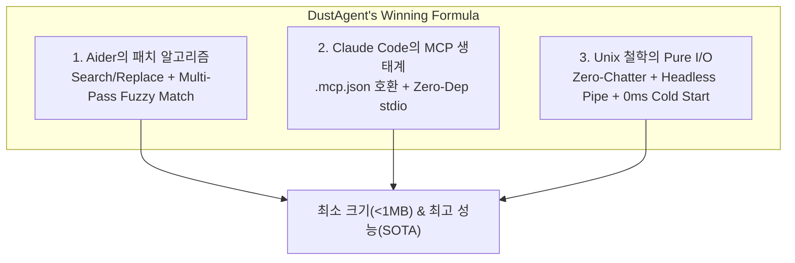

# 🎯 06. 종합 비교 매트릭스 및 DustAgent 차별화 전략

> 관련 문서: [[경쟁사분석/index|경쟁사 분석 MOC]], [[01_개념_및_설계철학]], [[02_시스템_아키텍처]], [[03_초경량_MCP_엔진]], [[04_인라인_패치_및_수정_엔진]]

본 문서는 앞서 분석한 5대 주요 코딩 어시스턴트들과 DustAgent를 정량·정성적으로 비교하고, DustAgent가 어떻게 최소한의 코드로 최고 수준의 성능을 달성하는지 그 승리 공식을 명시합니다.

---

## 1. 종합 기술 비교 매트릭스

| 평가 지표 | OpenCode | Codex / Copilot | Claude Code | Aider | Cursor (Cmd+K) | **DustAgent** |
| :--- | :---: | :---: | :---: | :---: | :---: | :---: |
| **인터랙션 요구도** | 높음 (확인 잦음) | 낮음 (Tab 수락) | 높음 (대화형) | 보통 (터미널 챗) | 보통 (Diff 수락) | **0 (Zero-Interaction)** |
| **실행 콜드스타트** | ~2초 | ~0.2초 | ~1.5초 | ~1초 | N/A (상주 IDE) | **< 0.03초 (즉시 실행)** |
| **패치 성공률** | 70% | 85% | 90% | **98%+** | 95%+ | **98%+ (Aider급)** |
| **MCP 지원** | 플러그인 | ❌ 없음 | **공식 지원** | ❌ 없음 | 제한적 지원 | **공식 규격 경량 stdio** |
| **토큰 낭비 (잡담)** | 심함 | 적음 | 심함 | 적음 | 적음 | **0% (Zero-Chatter)** |
| **런타임 의존성** | 거대 Python | VS Code 확장 | Node.js 번들 | 복잡한 Python | Electron IDE | **단일 스크립트 / 바이너리** |
| **헤드리스 파이프** | 불가능 | 불가능 | 불가능 | 제한적 | 불가능 | **완벽 지원 (`\| dust`)** |

---

## 2. DustAgent의 3대 승리 공식 (Secret Sauce)

### 1) 패치 신뢰도의 승리 (from Aider)
* 전체 파일 다시 쓰기(Whole-file rewrite)의 멍청한 토큰 낭비와 환각을 거부합니다.
* Aider가 검증한 **Search/Replace 블록**을 사용하되, 4단계 **Fuzzy Whitespace Normalizer**를 내장하여 들여쓰기 1~2칸 오차로 인한 패치 실패를 완전히 방어합니다.

### 2) 확장성의 승리 (from Claude Code)
* 독자적인 도구 API를 발명하지 않습니다. Anthropic의 오픈 표준인 **Model Context Protocol (MCP)**을 그대로 수용합니다.
* 단, Claude Code처럼 무거운 Node.js 런타임을 요구하지 않고 표준 `stdio JSON-RPC 2.0`만으로 동작하여 모든 기존 MCP 서버를 가볍게 활용합니다.

### 3) 속도와 파이프라이닝의 승리 (from Unix Philosophy)
* 사용자와 잡담을 나누지 않습니다.
* `입력 (STDIN / File Range)` -> `LLM (Claude 3.5 Sonnet / GPT-4o)` -> `출력 (In-place Patch / STDOUT)`
* 에디터, Git 훅, CI 파이프라인 어디에나 레고 블록처럼 끼워 넣을 수 있는 유일한 마이크로 코딩 에이전트가 됩니다.

---

## 3. 결론

> **"군더더기는 모두 깎아내고, 오직 지능(LLM)과 손발(Patch & MCP)만 남긴다."**

이로써 DustAgent는 가장 작으면서도 성능은 현존 최고 수준(SOTA)을 유지하는 유일무이한 인라인 에이전트의 위상을 확립합니다.

---
[[dustagent_moc|← DustAgent 지식 베이스 홈으로 돌아가기]]
